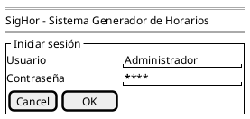

# Registro de Conversaciones - Proyecto pySigHor RUP

## Resumen
Este archivo mantiene un registro cronológico de todas las conversaciones, decisiones y evolución del proyecto de modernización de SigHor usando metodología RUP.

---

## Conversación 1: Inicialización del Proyecto RUP
**Fecha**: 2025-01-04  
**Participantes**: Manuel (Usuario) + Claude Code

### Contexto Inicial
- **Situación**: Proyecto pySigHor existente con análisis de sistema legacy SigHor (1998, Visual Basic 3.0)
- **Solicitud**: Crear CLAUDE.md en castellano para orientar futuras instancias
- **Resultado**: CLAUDE.md creado con documentación completa del proyecto de arqueología de software

### Evolución hacia RUP

#### Planteamiento del Usuario
Manuel propone:
> "El proyecto a largo plazo sería reescribir este proyecto en un lenguaje actual (podría ser java, podría ser algo web, ya lo veremos). Pero, para esto, quisiera seguir la metodología RUP, de modo que el proyecto además me sirva como herramienta didáctica"

#### Reflexión Estratégica
Claude propone reflexionar paso a paso sobre:
1. **Contexto actual**: Sistema legacy en VB3.0 (1998) 
2. **Objetivo**: Reescribir en tecnología moderna usando RUP
3. **Propósito dual**: Producto funcional + herramienta didáctica

#### Preguntas Estratégicas Planteadas
1. **Tecnología objetivo**: ¿Java, web, Python, u otras opciones?
2. **Alcance didáctico**: ¿Todas las disciplinas RUP o enfoque específico?
3. **Nivel de fidelidad**: ¿Réplica exacta o modernización de lógica de negocio?
4. **Entregables**: ¿Qué artefactos RUP generar?
5. **Herramientas**: ¿Preferencias para modelado UML, gestión de requisitos?

### Decisiones Acordadas

#### 1. **Tecnología Objetivo**
- **Decisión**: Postponer hasta fase de diseño
- **Rationale**: Alineado con RUP, arquitectura debe dirigir selección tecnológica
- **Beneficio**: Evita sesgos prematuros

#### 2. **Alcance RUP**
- **Decisión**: Completo (todas las disciplinas y fases)
- **Objetivo**: Enfoque didáctico integral

#### 3. **Estrategia de Modernización**
- **Decisión**: Enfoque de dos fases
  - **Fase 1**: Réplica fiel (port directo)
  - **Fase 2**: Reingeniería sobre base moderna
- **Rationale**: Minimiza riesgos, permite validación incremental

#### 4. **Entregables**
- **Decisión**: Todos los artefactos RUP
- **Formato**: PlantUML + Markdown
- **Beneficio**: Versionable, estándar industrial

#### 5. **Herramientas**
- **Decisión**: PlantUML para diagramas UML
- **Rationale**: Texto plano, fácil versionado, amplia compatibilidad

### Estructura del Proyecto Acordada

```
pySigHor-RUP/
├── 00-Legacy-Analysis/          # Análisis del sistema original
├── 01-Inception/                # Fase de Inicio
├── 02-Elaboration/              # Fase de Elaboración
├── 03-Construction/             # Fase de Construcción
├── 04-Transition/               # Fase de Transición
└── artifacts/                   # Artefactos transversales
```

### Siguiente Paso Acordado
- **Inmediato**: Actualizar CLAUDE.md con metodología RUP
- **Propuesta**: Crear registro de conversaciones (este archivo)
- **Siguiente**: Comenzar Fase de Inicio (Inception)

### Observaciones Metodológicas
- **Fortaleza del enfoque**: Muy metodológico, considera todos los aspectos de RUP
- **Valor didáctico**: Proyecto servirá como caso de estudio completo
- **Flexibilidad**: Decisiones técnicas basadas en análisis, no en suposiciones

---

## Conversación 2: Actualización de CLAUDE.md y Registro de Conversaciones
**Fecha**: 2025-01-04  
**Participantes**: Manuel (Usuario) + Claude Code

### Solicitud
Manuel solicita:
1. Actualizar CLAUDE.md con lo que vamos a hacer
2. Mantener y actualizar un registro de conversaciones

### Acciones Realizadas

#### 1. **Actualización de CLAUDE.md**
- **Estado**: ✅ Completado
- **Cambios realizados**:
  - Agregada sección "Proyecto de Modernización con RUP"
  - Documentada estrategia de dos fases
  - Incluidas todas las disciplinas RUP
  - Especificada estructura del proyecto
  - Definidas herramientas y formatos

#### 2. **Creación del Registro de Conversaciones**
- **Estado**: ✅ En proceso (este archivo)
- **Formato**: Markdown cronológico
- **Contenido**: Decisiones, discusiones, evolución del proyecto

### Valor Agregado
- **Trazabilidad**: Todas las decisiones quedan documentadas
- **Didáctico**: Futuras referencias pueden ver la evolución del pensamiento
- **Metodológico**: Alineado con disciplina de Gestión de Configuración de RUP

---

## Conversación 3: Establecimiento de Protocolo de Trabajo
**Fecha**: 2025-01-04  
**Participantes**: Manuel (Usuario) + Claude Code

### Refinamiento del Proceso de Trabajo

#### Protocolo Establecido por Manuel
> "Un detalle adicional: primero, antes de abordar la generación de cualquier artefacto, siempre lo debatiremos antes para estar seguros de lo que hemos de hacer."

#### Implicaciones Metodológicas
- **Proceso colaborativo**: Debate previo obligatorio antes de generar artefactos
- **Validación anticipada**: Asegurar alineación antes de invertir tiempo en generación
- **Refinamiento iterativo**: Ajustar enfoques basado en discusión
- **Reducción de retrabajo**: Evitar generar artefactos incorrectos

#### Protocolo de Trabajo Acordado
1. **Propuesta inicial**: Claude propone qué artefacto generar y cómo
2. **Debate**: Discusión sobre contenido, formato, enfoque
3. **Refinamiento**: Ajustes basados en retroalimentación
4. **Aprobación**: Confirmación explícita antes de generar
5. **Generación**: Creación del artefacto acordado
6. **Revisión**: Validación del resultado

---

## Conversación 4: Definición del Primer Artefacto - Modelo del Dominio
**Fecha**: 2025-01-04  
**Participantes**: Manuel (Usuario) + Claude Code

### Selección del Artefacto Inicial

#### Propuesta de Claude
Claude propone debatir qué artefacto de Inception generar primero, sugiriendo opciones típicas:
- Documento de Visión
- Caso de Negocio
- Análisis de Stakeholders
- Evaluación de Riesgos
- Modelo de Casos de Uso inicial

#### Decisión de Manuel
> "Empezaríamos con el modelo del dominio, generado a partir de las entidades que tenemos en el proyecto original."

#### Rationale de la Decisión
- **Fundamento sólido**: Partir de conocimiento concreto vs. especulaciones
- **Vocabulario común**: Establecer terminología del proyecto
- **Aprovechamiento del análisis existente**: Usar el trabajo de ingeniería inversa ya realizado

### Especificaciones del Modelo del Dominio

#### Nivel de Detalle Acordado
> "Empecemos con el modelo del dominio infiriéndolo del modelo de datos original, en la forma de un diagrama de clases con un nivel conceptual puro y algunos atributos."

#### Características Técnicas
- **Formato**: Diagrama de clases UML (PlantUML)
- **Nivel**: Conceptual puro + algunos atributos clave
- **Fuente**: Modelo de datos original (tablas M_*, S_*, R_*)
- **Enfoque**: Inferencia desde estructura de BD existente

---

## Conversación 5: Debate sobre Especificaciones del Modelo del Dominio
**Fecha**: 2025-01-04  
**Participantes**: Manuel (Usuario) + Claude Code

### Propuesta de Claude
Claude propone estructura del modelo del dominio con entidades core, de apoyo y temporales, planteando 4 puntos para debate.

### Decisiones de Manuel sobre Especificaciones

#### 1. **Entidades Temporales**
- **Decisión**: Sí incluir entidades temporales
- **Especificación**: "estereotipándolas como entidades temporales"
- **Implicación**: Usar estereotipos UML (<<temporal>>) para diferenciarlas

#### 2. **Nivel de Detalle de Atributos**
- **Decisión**: "detalles esenciales solamente"
- **Enfoque**: Incluir solo atributos clave para comprensión conceptual
- **Evitar**: Saturar el modelo con detalles de implementación

#### 3. **Sistema de Prioridades**
- **Decisión**: "las prioridades del profesor los guardamos como un entero"
- **Especificación**: "Documentamos el proceso para extraerlas y usarlas al momento de cruzar los datos"
- **Enfoque**: Simplificar representación conceptual, documentar algoritmo por separado

#### 4. **Restricciones OCL**
- **Decisión**: "No sé lo que son restricciones OCL: modélalas para ver si son inteligibles"
- **Enfoque**: Experimental para evaluar valor didáctico
- **Propósito**: Determinar si agregan claridad al modelo conceptual

---

## Conversación 6: Generación del Modelo del Dominio
**Fecha**: 2025-01-04  
**Participantes**: Manuel (Usuario) + Claude Code

### Autorización para Generar Artefacto
Manuel autoriza la generación con un simple:
> "adelante!"

### Artefactos Generados

#### 1. **Estructura de Directorios**
- **Creado**: `01-Inception/modelo-dominio/`
- **Propósito**: Organización de artefactos según estructura RUP acordada

#### 2. **Diagrama PlantUML**
- **Archivo**: `01-Inception/modelo-dominio/modelo-dominio.puml`
- **Contenido**:
  - 9 entidades core y de apoyo del dominio
  - 4 entidades temporales con estereotipo `<<temporal>>`
  - Relaciones principales entre entidades
  - Restricciones OCL como ejemplos educativos
  - Documentación del algoritmo de prioridades
  - Patrones de bloques horarios

#### 3. **Documentación Complementaria**
- **Archivo**: `01-Inception/modelo-dominio/modelo-dominio.md`
- **Contenido**:
  - Introducción y propósito del modelo
  - Descripción detallada de cada entidad
  - Explicación de relaciones
  - Algoritmo de codificación de prioridades
  - Patrones de bloques horarios
  - Restricciones OCL documentadas
  - Glosario de términos
  - Referencias al sistema legacy

### Características Implementadas

#### **Entidades Core**
- **Aula**: Espacios físicos con capacidad y propiedades
- **Curso**: Asignaturas con información académica completa
- **Profesor**: Docentes con sistema de prioridades codificado
- **Horario**: Resultado final de asignaciones

#### **Entidades de Apoyo**
- **Edificio**: Agrupación de aulas
- **Recurso**: Características de equipamiento
- **Programa**: Carreras académicas

#### **Entidades Temporales (<<temporal>>)**
- **PreHorario**: Asignaciones preliminares
- **BloqueHorario**: Patrones de horarios
- **AulaLibre**: Cálculos de optimización
- **AulaOcupada**: Control de disponibilidad

#### **Características Especiales**
- **Restricciones OCL**: Ejemplos educativos de reglas de negocio
- **Algoritmo de prioridades**: Documentación completa del sistema binario
- **Patrones horarios**: Tabla completa de bloques H1-H8, HE, HV

### Valor del Artefacto Generado

#### **Cumplimiento de Especificaciones**
- ✅ Nivel conceptual puro con atributos esenciales
- ✅ Entidades temporales estereotipadas
- ✅ Prioridades como entero con algoritmo documentado
- ✅ Restricciones OCL como ejemplo educativo

#### **Valor Didáctico**
- **Vocabulario común** establecido para el proyecto
- **Base sólida** para casos de uso y requisitos futuros
- **Ejemplos de OCL** para aprendizaje de modelado formal
- **Documentación completa** con referencias al sistema legacy

#### **Calidad del Artefacto**
- **Formato profesional** con PlantUML y Markdown
- **Trazabilidad** al sistema legacy original
- **Extensibilidad** para fases futuras del proyecto
- **Comprensibilidad** para stakeholders técnicos y de negocio

### Estado del Proyecto
- **Primer artefacto RUP**: ✅ Completado exitosamente
- **Protocolo de trabajo**: ✅ Aplicado correctamente
- **Documentación**: ✅ Actualizada en tiempo real

---

## Conversación 7: Ajustes al Modelo del Dominio
**Fecha**: 2025-01-04  
**Participantes**: Manuel (Usuario) + Claude Code

### Solicitud de Ajustes
Manuel solicita ajustes específicos al modelo del dominio generado:

#### Ajustes al Diagrama PlantUML
1. **Relaciones UML canónicas**: Usar `*--`, `o--`, `-->` en lugar de `||--||`
2. **Sin formateo técnico**: Eliminar `!theme`, `skinparam`, `title`
3. **Sin tipos de datos**: Atributos como `+id` en lugar de `+id: Integer`
4. **Restricciones en español**: Lenguaje natural en lugar de sintaxis OCL

### Generación del Modelo Replanteado por Manuel
Manuel replantea completamente el modelo con:

#### Nuevo Enfoque Conceptual
- **Modelo simplificado**: Solo entidades esenciales del dominio
- **Package CampusUniversitario**: Agrupa Edificio y Aula
- **Relaciones conceptuales**: Enfoque en relaciones de negocio
- **Horario como entidad central**: Conecta Profesor, Curso y Aula

#### Confirmación del BloqueHorario
- **Verificado**: Cada curso tiene asociado un patrón horario (H1-H8, HE, HV)
- **Documentado**: Sistema de bloques del legacy confirmado
- **Relación**: `Curso .. BloqueHorario` representa patrón preferido

### Reescritura del Markdown
Manuel replantea completamente el documento con:

#### Mejoras Estructurales
- **Glosario en tabla**: Información densa y organizada
- **Relaciones agrupadas**: Por contexto (académicas, campus, asignación, preferencias)
- **Restricciones por entidad**: Organización en tabla
- **Presentación profesional**: Diagramas centrados, formato conciso

#### Estilo de Documentación Establecido
- **Títulos en minúsculas**: Estilo ortográfico correcto
- **Sin decoración**: Eliminación de checkmarks y bullets
- **Enfoque profesional**: Documentos para usar, no para impresionar
- **Información densa**: Máximo contenido útil, mínimo ruido

### Valor del Replanteamiento
- **Conceptualmente superior**: Enfoque en dominio vs. implementación
- **Visualmente elegante**: Estructura clara y profesional
- **Pragmático**: Información útil y accesible
- **Extensible**: Base sólida para artefactos futuros

---

## Conversación 8: Consulta sobre Persistencia de Contexto
**Fecha**: 2025-01-04  
**Participantes**: Manuel (Usuario) + Claude Code

### Pregunta sobre Continuidad
Manuel consulta sobre la persistencia del contexto al cerrar/abrir sesiones:
> "si cierro sesión ¿pierdes contexto o lo mantienes usando claude.md y otros artefactos?"

### Respuesta sobre Mantenimiento del Contexto
- **Nueva sesión**: Pierdo el contexto de conversación actual
- **Artefactos disponibles**: CLAUDE.md, conversation-log.md, código generado
- **Recuperación**: Nueva instancia puede usar artefactos para reconstruir contexto
- **Continuidad**: Los archivos mantienen trazabilidad completa del proyecto

### Estado Actual del Proyecto
- **Modelo del dominio**: ✅ Completado y refinado
- **Documentación**: ✅ Actualizada con estilo establecido
- **Próximo paso**: Pendiente definición del siguiente artefacto RUP

---

## Conversación 9: Identificación de Actores y Casos de Uso
**Fecha**: 2025-01-04  
**Participantes**: Manuel (Usuario) + Claude Code

### Propuesta del Siguiente Artefacto
Manuel propone continuar con RUP generando actores y casos de uso:
> "tocaría proceder con la identificación de actores y casos de uso iniciales usando el modelo del dominio actual como base"

### Enfoque Metodológico Acordado

#### Proceso Iterativo Definido
1. **Identificar** actores y casos de uso principales con conocimiento actual
2. **Documentar** limitaciones del modelo conforme emerjan
3. **Refinar** modelo del dominio cuando casos de uso revelen conceptos faltantes
4. **Registrar** proceso de refinamiento en conversation-log

#### Estrategia del Proyecto
- **Base**: Sistema legacy (fidelidad al original)
- **Mejoras**: Postergadas hasta después de análisis y diseño
- **Funcionalidad**: CRUD entidades → Generación de horario

#### Artefactos a Generar
1. **Diagrama de Actores y Casos de Uso** (UML tradicional)
2. **Diagrama de Contexto** (máquina de estados con transiciones)

### Concepto del Diagrama de Contexto

#### Explicación de Manuel
> "El diagrama de contexto lo uso para relacionar los casos de uso de un actor como un todo. [...] identificar los casos de uso correctamente (conversación atómica actor-sistema iniciada por el actor que concluye en un resultado observable de interés) y después [...] describir el sistema como un conjunto de estados que se transitan usando los casos de uso."

#### Características del Diagrama de Contexto
- **Estados**: Pantallas/interfaces del sistema
- **Transiciones**: Casos de uso que llevan de una pantalla a otra
- **Casos de uso**: Conversaciones atómicas actor-sistema (NO secuencias)
- **Patrón**: Hub central (MENU_PRINCIPAL) conecta con estados específicos
- **Navegación**: Bidireccional (ida y vuelta al menú)

#### Estados Candidatos para SigHor
- `NO_AUTENTICADO` (pantalla login)
- `MENU_PRINCIPAL` (dashboard)
- `GESTIONANDO_PROFESORES` (CRUD profesores)
- `GESTIONANDO_CURSOS` (CRUD cursos)
- `GESTIONANDO_AULAS` (CRUD aulas)
- `GENERANDO_HORARIO` (algoritmo de generación)
- `CONSULTANDO_HORARIOS` (visualización resultados)

### Errores Conceptuales Identificados y Corregidos

#### Error 1: Actor "Sistema de Archivos"
- **Error de Claude**: Proponer "Sistema de Archivos" como actor
- **Corrección de Manuel**: 
  > "¡Sistema de archivos no es un actor! Es un error gravísimo. [...] no ataca al sistema sino más bien es un servicio que utilizamos."

**Aprendizaje clave**:
- **Actores**: Inician conversaciones, tienen objetivos, obtienen valor
- **Servicios**: Infraestructura que el sistema utiliza internamente

#### Error 2: Casos de Uso "Gestionar"
- **Error de Claude**: Proponer casos de uso como `gestionarProfesores()`
- **Corrección de Manuel**: 
  > "'gestionar' es otro error gravísimo, producto de la visión ágil. Para que un caso de uso sea verdaderamente atómico, una regla que yo utilizo es encontrarle paralelo con uno de las cuatro acciones de CRUD."

**Aprendizaje clave**:
- **"Gestionar"**: Demasiado amplio, no atómico, ambiguo
- **CRUD**: Casos de uso específicos, atómicos, testeables

#### Casos de Uso Corregidos (Patrón CRUD)
- `crearProfesor()`, `listarProfesores()`, `editarProfesor()`, `eliminarProfesor()`
- `crearCurso()`, `listarCursos()`, `editarCurso()`, `eliminarCurso()`
- `crearAula()`, `listarAulas()`, `editarAula()`, `eliminarAula()`

### Valor Didáctico de los Errores
- **Error sistema de archivos**: Clarifica concepto fundamental de actor
- **Error "gestionar"**: Refuerza importancia de atomicidad en casos de uso
- **Proceso iterativo**: Demuestra refinamiento continuo del entendimiento

### Estado Actual
- **Conceptos fundamentales**: ✅ Clarificados
- **Errores conceptuales**: ✅ Identificados y corregidos
- **Próximo paso**: Continuar con identificación específica de actores y casos de uso CRUD

---

## Conversación 10: Generación de Actores y Casos de Uso
**Fecha**: 2025-01-04  
**Participantes**: Manuel (Usuario) + Claude Code

### Debate sobre Formato de Generación
Claude pregunta sobre el formato para generar el artefacto:

#### Opciones Debatidas
1. **PlantUML**: Diagrama visual estándar UML
2. **Tabla**: Información densa (estilo establecido por Manuel)
3. **Ambos**: Combinación de ambos enfoques

#### Decisión de Manuel
> "Hagámoslo mas bien a la inversa: plantuml y luego tabla..."

**Enfoque acordado**: PlantUML primero (visualización), tabla después (información densa)

### Definición de Actores

#### Actores Identificados
- **Administrador de Horarios**: El actor "potente" que maneja todo el sistema
- **Consultor de Horarios**: Actor "observador" que solo consulta

#### Clarificación de Manuel
> "solo el administrador de horarios, porque el otro actor será el consultador (o consultor le llamaste, creo), pero es un observador sin más: el potente es el Administrador de horarios."

### Nomenclatura de Casos de Uso

#### Especificación de Manuel
> "a los casos de uso vamos ya haciendo que 'huelan' al código en el que se convertiran. Por ejemplo, crearProfesor() ;)"

**Convención establecida**: Casos de uso con nomenclatura que sugiere implementación directa

### Generación del Artefacto

#### Autorización
Manuel autoriza la generación con:
> "adelante!"

#### Artefactos Generados
1. **Directorio**: `01-Inception/actores-casos-uso/`
2. **Diagrama PlantUML**: `actores-casos-uso.puml`
3. **Documentación**: `actores-casos-uso.md`

#### Contenido Generado
- **2 actores**: Administrador de Horarios, Consultor de Horarios
- **24 casos de uso CRUD**: Organizados por packages (Programas, Cursos, Profesores, Campus)
- **Casos de uso especiales**: configurarPreferenciasProfesor(), asignarProfesorACurso(), generarHorario(), consultarHorario()
- **Documentación completa**: Tablas de actores, casos de uso por entidad, descripciones detalladas

### Refinamiento por Manuel

#### Ajustes Realizados
Manuel realiza ajustes al artefacto generado:

1. **División en múltiples diagramas**:
   - `actores-casos-uso-001.puml`: Gestión de Programas y Cursos
   - `actores-casos-uso-002.puml`: Profesores, Consulta, Generación, Asignaciones
   - `actores-casos-uso-003.puml`: Gestión del Campus

2. **Mejoras visuales**:
   - `left to right direction`: Mejor orientación
   - Variación en conectores: `-->` y `<--`
   - Actor dentro del package en diagrama 003

3. **Herencia de actores** (diagrama 002):
   ```plantuml
   consultor <|-up- admin
   ```

4. **Actualización del markdown**:
   - Tabla con 3 diagramas SVG
   - Referencias a los 3 archivos PlantUML

### Clarificación de Herencia

#### Pregunta de Claude
Claude consulta sobre el significado de la herencia de actores.

#### Explicación de Manuel
> "consultor <|-up- admin significa que el administrador es una especialización del consultor. El consultor solo ejecuta un caso de uso. El admin, el del consultor más otros."

**Jerarquía clarificada**:
- **Consultor de Horarios** (generalización): `consultarHorario()`
- **Administrador de Horarios** (especialización): `consultarHorario()` + todos los demás casos de uso

**Lógica**: El Administrador ES-UN Consultor con capacidades adicionales

### Estado del Artefacto
- **Diagramas PlantUML**: ✅ 3 diagramas organizados y optimizados
- **Documentación**: ✅ Completa con tablas y descripciones
- **Herencia de actores**: ✅ Clarificada y correctamente modelada
- **Nomenclatura**: ✅ Casos de uso "que huelan a código"

### Próximo Paso
Pendiente: Diagrama de contexto (máquina de estados con transiciones)

---

## Conversación 11: Clarificación del Concepto de Diagrama de Contexto
**Fecha**: 2025-01-05  
**Participantes**: Manuel (Usuario) + Claude Code

### Contexto de la Conversación

Manuel solicita repasar el concepto de "Diagrama de contexto" antes de proceder con su generación, que es el siguiente artefacto en la secuencia RUP.

### Comprensión Inicial de Claude

Claude muestra entendimiento parcial del concepto basándose en el registro de conversaciones:

#### Características Identificadas
- **Máquina de estados**: Sistema como conjunto de estados que se transitan
- **Estados**: Pantallas/interfaces del sistema
- **Transiciones**: Casos de uso como transiciones entre estados
- **Patrón hub**: `MENU_PRINCIPAL` conecta con estados específicos
- **Navegación bidireccional**: Ida y vuelta al menú

#### Estados Candidatos para SigHor
- `NO_AUTENTICADO`, `MENU_PRINCIPAL`, `GESTIONANDO_PROFESORES`, `GESTIONANDO_CURSOS`, `GESTIONANDO_AULAS`, `GENERANDO_HORARIO`, `CONSULTANDO_HORARIOS`

### Ejemplo Educativo Proporcionado

Manuel proporciona archivo ejemplo en `zzzTemp/ejemploDiagramaContexto.puml` para profundizar el entendimiento.

#### Características del Ejemplo
- **Estados definidos**: `NO_AUTENTICADO`, `MENU_PRINCIPAL`, `EN_TEST`, `REVISION_TEST`, `GESTION_PAQUETES`, `VISUALIZACION_ESTADISTICAS`
- **Transiciones etiquetadas**: Casos de uso en `note on link`
- **Estado inicial**: `[*] --> NoAuth`
- **Transiciones autorreflexivas**: `Test --> Test` (realizarDuda())
- **Múltiples casos de uso por transición**: Una transición puede tener varios casos de uso relacionados

### Clarificación Fundamental: Un Diagrama por Actor

Manuel introduce el concepto clave:

#### Perspectiva por Actor
> "Hay un diagrama de contexto por actor. Es lo que permite ver el sistema como un todo para ese actor y dónde se especifica la secuencialidad"

#### Especificación de Secuencialidad
> "aquí quedan explícitas muchas precondiciones que de otro modo tendrían que especificarse textualmente"

**Ejemplo práctico**:
- **Sin diagrama**: "Precondición: el usuario debe estar autenticado y en el menú principal"
- **Con diagrama**: Se ve gráficamente que no hay transición directa desde `NO_AUTENTICADO` a `EN_TEST`

#### Implicaciones para SigHor
- **Administrador de Horarios**: Diagrama con todos los estados CRUD + generación
- **Consultor de Horarios**: Diagrama simplificado con solo consulta

### Valor Analítico del Diagrama de Contexto

Manuel explica el **poder analítico** del diagrama:

#### Detección de Casos de Uso Innecesarios
> "Casos de uso que se previeron, pero no se usan (al menos para un actor en concreto), porque no aparecen en el diagrama de contexto"

#### Detección de Casos de Uso Omitidos
> "Casos de uso que se omitieron: porque para alguna transición no encontramos caso de uso que la permita"

#### Validación Cruzada
- **Casos de uso → Diagrama**: ¿Todos los casos de uso tienen lugar en el flujo?
- **Diagrama → Casos de uso**: ¿Todas las transiciones tienen caso de uso que las permita?

### Casos de Uso Compuestos (Con Cuidado)

#### Ejemplo del Diagrama
`MENU_PRINCIPAL` → `GESTION_PAQUETES` con `comprarPaquetes()` + `resincronizarPaquetes()`

#### Observación de Manuel
> "se puede admitir (con cuidado) que alguna transición requiera dos casos de uso, uno a continuación de otro [...] De todos modos, ese estado no me termina de convencer ;)"

#### Señales de Alerta
- Múltiples casos de uso para una transición pueden indicar:
  - Estado mal definido
  - Falta de atomicidad en el diseño
  - Necesidad de estado intermedio

### Concepto Completo del Diagrama de Contexto

#### Definición Completa
- **Diagrama de contexto por actor**: Máquina de estados UML que muestra la perspectiva completa de un actor específico sobre el sistema
- **Estados**: Pantallas/interfaces que el actor puede experimentar
- **Transiciones**: Casos de uso que permiten pasar de un estado a otro
- **Precondiciones visuales**: La topología del diagrama hace explícitas las restricciones de navegación

#### Metodología RUP
Manuel aclara que no es metodología propia:
> "me gustaría decir que es mi metodología, pero es RUP en su máxima expresión"

### Valor Educativo y Metodológico

#### Ventajas del Enfoque
- **Completitud**: Cada actor ve todo su "universo" de interacción
- **Claridad**: Las restricciones de navegación son visualmente obvias
- **Validación**: Fácil detectar caminos imposibles o estados inalcanzables
- **Análisis**: Identificación de casos de uso innecesarios u omitidos

#### Calidad del Diseño
- **Coherencia**: Asegurar que todos los casos de uso tengan lugar en el flujo
- **Minimalismo**: Eliminar casos de uso que no se usan realmente
- **Completitud**: Identificar funcionalidad faltante

### Estado del Proyecto

- **Concepto de diagrama de contexto**: ✅ Clarificado completamente
- **Ejemplo educativo**: ✅ Analizado y comprendido
- **Metodología RUP**: ✅ Confirmada como base teórica
- **Próximo paso**: Crear diagramas de contexto para los actores de SigHor

### Preparación para Próximo Artefacto

Con el concepto clarificado, el proyecto está listo para generar:
1. **Diagrama de contexto del Administrador de Horarios**: Estados completos del sistema
2. **Diagrama de contexto del Consultor de Horarios**: Estados limitados a consulta
3. **Validación cruzada**: Verificar coherencia entre casos de uso y diagramas de contexto

---

## Conversación 12: Generación y Corrección Metodológica del Diagrama de Contexto
**Fecha**: 2025-01-05  
**Participantes**: Manuel (Usuario) + Claude Code

### Generación del Diagrama de Contexto del Administrador

#### Primera Iteración
Claude genera el diagrama de contexto para el Administrador de Horarios con:
- **11 estados**: NO_AUTENTICADO, MENU_PRINCIPAL, GESTIONANDO_* (6 estados), CONFIGURANDO_ASIGNACIONES, GENERANDO_HORARIO, CONSULTANDO_HORARIOS
- **Transiciones**: Casos de uso como transiciones entre estados
- **Patrón hub**: MENU_PRINCIPAL como centro de navegación
- **Documentación completa**: Análisis de estados, transiciones y precondiciones

#### Resultado Inicial
- **Diagrama PlantUML**: `diagrama-contexto-administrador.puml`
- **Documentación**: `diagrama-contexto-administrador.md`
- **Validación**: Todos los casos de uso incluidos en el flujo

### Identificación de Problemas Metodológicos

Manuel identifica **dos problemas metodológicos fundamentales**:

#### **Problema 1: Nivel de Abstracción Incorrecto**

**Error detectado**:
- Mención de "botones", "breadcrumbs", "dashboard" en consideraciones de implementación
- Asunción de interfaz gráfica web/desktop específica

**Por qué es problemático**:
- **Fase Inception**: Solo debe manejar conceptos de negocio y casos de uso
- **Asunción prematura**: El sistema podría no ser gráfico (ej: sistema gestionado por Alexa)
- **Violación RUP**: Elementos de UI vienen en diseño/prototipado, no en análisis

#### **Problema 2: Optimización de Estados Perdida (Simplificación Ágil)**

**Error detectado**:
- Estados simplificados "GESTIONANDO_*" estilo ágil
- No aprovecha optimizaciones de flujo natural

**Por qué es problemático**:
- **Patrón perdido**: crear() → estado intermedio mínimo → editar() completo
- **Flujo natural**: Crear algo es crearlo mínimamente y luego entrar a edición
- **Oportunidad perdida**: Optimización de experiencia de usuario

**Ejemplo de mejora**:
```
MENU_PRINCIPAL → crearPrograma() → EDITANDO_PROGRAMA
EDITANDO_PROGRAMA → guardar() → LISTANDO_PROGRAMAS  
LISTANDO_PROGRAMAS → editarPrograma() → EDITANDO_PROGRAMA
```

### Correcciones Metodológicas Requeridas

#### **1. Estados más granulares**
- Separar LISTANDO, EDITANDO, CREANDO por separado
- Eliminar estados "GESTIONANDO_*" que agrupan múltiples responsabilidades

#### **2. Flujos optimizados**
- Crear mínimo → editar completo
- Seguir patrones naturales de interacción usuario-sistema

#### **3. Documentación sin referencias de UI**
- Mantener nivel conceptual apropiado para fase Inception
- Evitar asumir tecnologías específicas de interfaz

#### **4. Nivel RUP apropiado**
- Solo conceptos de negocio y casos de uso
- No anticipar decisiones de diseño/implementación

### Aprendizajes Clave

#### **Error Conceptual: Mezclar Niveles de Abstracción**
- **Inception**: Análisis de negocio, casos de uso, conceptos de dominio
- **Diseño**: Interfaces, tecnologías, componentes de UI
- **Implementación**: Código, frameworks, herramientas específicas

#### **Error de Granularidad: Simplificación Ágil**
- **Problema**: Estados "GESTIONANDO_*" ocultan flujo natural
- **Solución**: Estados granulares que reflejan interacciones reales
- **Beneficio**: Optimización de experiencia usuario desde análisis

#### **Error de Asunción: Tecnología Específica**
- **Problema**: Asumir interfaz gráfica web/desktop
- **Solución**: Mantener independencia tecnológica
- **Beneficio**: Flexibilidad en decisiones de diseño posteriores

### Valor Educativo del Error

#### **RUP en su Máxima Expresión**
- **Disciplina**: Cada fase tiene su propósito y nivel de abstracción
- **Separación**: No mezclar análisis con diseño/implementación
- **Progresión**: Cada artefacto construye sobre los anteriores sin anticipar

#### **Calidad del Proceso**
- **Detección temprana**: Identificar errores metodológicos en revisión
- **Corrección sistemática**: Aplicar principios RUP para corregir
- **Aprendizaje**: Documentar errores para evitar repetición

### Estado del Proyecto

- **Diagrama de contexto**: ✅ Generado (primera iteración)
- **Problemas metodológicos**: ✅ Identificados y documentados
- **Correcciones**: ⏳ Pendientes de aplicar
- **Aprendizaje**: ✅ Documentado para referencia futura

### Especificación del Patrón Granular Optimizado

Manuel especifica el patrón correcto para estados granulares:

#### **Ejemplo: Gestión de Profesores**

**En lugar de**:
```
GESTIONANDO_PROFESORES (con CRUD interno)
```

**Usar**:
```
LISTANDO_PROFESORES → editarProfesor() → EDITANDO_PROFESOR → editarProfesor() & listarProfesores() → LISTANDO_PROFESORES
LISTANDO_PROFESORES → crearProfesor() → EDITANDO_PROFESOR (con datos mínimos) y a partir de aquí ya es una edición
```

#### **Flujo Granular y Optimizado**

**Desde LISTANDO_PROFESORES**:
1. **Para editar**: `editarProfesor()` → **EDITANDO_PROFESOR** (con datos completos)
2. **Para crear**: `crearProfesor()` → **EDITANDO_PROFESOR** (con datos mínimos)

**Desde EDITANDO_PROFESOR**:
- **Continuar editando**: `editarProfesor()` → **EDITANDO_PROFESOR** (loop autorreflexivo)
- **Volver a lista**: `listarProfesores()` → **LISTANDO_PROFESORES**

#### **Principio Clave**
- **Crear** = insertar datos mínimos + **redirigir inmediatamente a edición**
- **Editar** = estado común para modificación (tanto creación como edición usan el mismo estado)
- **Un solo estado de edición** sirve para ambos casos (crear nuevo vs editar existente)

#### **Ventajas del Patrón**
- **Flujo natural**: Crear algo es empezar a editarlo
- **Reutilización**: Un estado de edición para ambos casos
- **Optimización**: El usuario puede seguir editando sin cambiar de contexto
- **Granularidad**: Estados específicos para cada tipo de operación
- **Experiencia**: Refleja interacciones naturales usuario-sistema

### Próximos Pasos

1. **Corregir diagrama de contexto**: Aplicar principios metodológicos y patrón granular
2. **Actualizar documentación**: Eliminar referencias de UI específica
3. **Validar correcciones**: Verificar adherencia a RUP
4. **Continuar con siguiente artefacto**: Una vez validado el diagrama corregido

---

## Conversación 13: Aplicación de Correcciones Metodológicas y Optimización de Casos de Uso
**Fecha**: 2025-01-05  
**Participantes**: Manuel (Usuario) + Claude Code

### Aplicación de Correcciones Metodológicas

#### **Corrección del Diagrama de Contexto**
Claude aplica las correcciones metodológicas identificadas:

**Estados Granulares Implementados**:
- **Antes**: Estados "GESTIONANDO_*" simplificados (estilo ágil)
- **Después**: Estados separados LISTANDO_X y EDITANDO_X (granularidad optimizada)

**Patrón Granular Optimizado Aplicado**:
- **Flujo crear**: `crearX()` → EDITANDO_X (con datos mínimos)
- **Flujo editar**: `editarX()` → EDITANDO_X (con datos completos)
- **Continuidad**: Estados EDITANDO autorreflexivos para edición continua
- **Retorno**: `listarX()` desde EDITANDO_X → LISTANDO_X

**Nivel de Abstracción Corregido**:
- **Eliminado**: Referencias a "dashboard", "breadcrumbs", elementos UI específicos
- **Enfoque**: Solo conceptos de negocio y casos de uso (nivel RUP Inception)
- **Independencia**: Sin asumir tecnología de interfaz específica

#### **Documentación Actualizada**

**Cambios Estructurales**:
- **Versión 2.0**: Refleja correcciones metodológicas aplicadas
- **Nuevas secciones**: Patrón granular explicado, consideraciones de análisis
- **Secciones modificadas**: Estados del sistema, transiciones, características del diseño
- **Eliminadas**: Referencias de implementación UI prematura

**Contenido Mejorado**:
- **Estados granulares**: Tabla actualizada con estados LISTANDO/EDITANDO
- **Transiciones optimizadas**: Patrón crear-editar documentado
- **Validación de casos de uso**: Análisis de completitud y coherencia
- **Consideraciones de análisis**: Nivel conceptual apropiado

### Reflexión de Optimización: Unificación de Casos de Uso

Manuel identifica una **optimización importante** en los casos de uso:

#### **Problema Detectado**
> "iniciarSesion() debe ir seguido de mostrarMenu(). Por tanto, todos los volverAlMenu() son realmente mostrarMenu(). Optimización: Reutilizar código usando un solo caso de uso mostrarMenu()"

#### **Análisis de Redundancia**
- **`iniciarSesion()`**: NO_AUTENTICADO → necesita mostrar menú
- **`volverAlMenu()`**: Desde cualquier estado → hace exactamente lo mismo
- **Problema**: Dos casos de uso para la misma funcionalidad básica

#### **Solución Optimizada**
**Unificación propuesta**:
- **Un solo caso de uso**: `mostrarMenu()`
- **Reutilización**: Mismo caso de uso desde múltiples estados
- **Coherencia**: Lógica unificada para mostrar el menú

**Transformación**:
```
Antes:
iniciarSesion(): NO_AUTENTICADO → MENU_PRINCIPAL
volverAlMenu(): ESTADO_X → MENU_PRINCIPAL

Después:
iniciarSesion(): NO_AUTENTICADO → (solo autenticación)
mostrarMenu(): Desde cualquier estado → MENU_PRINCIPAL
```

#### **Ventajas de la Optimización**
- **Código reutilizable**: Un solo caso de uso para mostrar menú
- **Mantenibilidad**: Cambios en una sola función
- **Coherencia**: Comportamiento uniforme
- **Simplicidad**: Menos redundancia en el diseño

#### **Aplicación Requerida**
- **Eliminar**: Casos de uso `volverAlMenu()` redundantes
- **Usar**: `mostrarMenu()` como caso de uso unificado
- **Actualizar**: Diagrama PlantUML y documentación

### Valor de la Optimización

#### **Mejora del Diseño**
- **Principio DRY**: Don't Repeat Yourself aplicado a casos de uso
- **Cohesión**: Funcionalidad relacionada unificada
- **Claridad**: Separación limpia entre autenticación y navegación

#### **Impacto en Implementación**
- **Reutilización**: Una función `mostrarMenu()` llamada desde múltiples contextos
- **Testeo**: Un solo caso de uso para probar
- **Mantenimiento**: Cambios centralizados

### Estado del Proyecto

- **Correcciones metodológicas**: ✅ Aplicadas (granularidad, nivel abstracción)
- **Optimización detectada**: ✅ Identificada y analizada
- **Próximo paso**: ⏳ Aplicar optimización de unificación de casos de uso

### Próximos Pasos

1. **Aplicar optimización**: Unificar casos de uso con `mostrarMenu()`
2. **Actualizar documentación**: Reflejar la optimización aplicada
3. **Validar diagrama final**: Verificar coherencia completa
4. **Continuar con siguiente artefacto**: Diagrama de contexto del Consultor

---

## Conversación 14: Aplicación de Optimización y Correcciones Metodológicas Finales
**Fecha**: 2025-01-05  
**Participantes**: Manuel (Usuario) + Claude Code

### Aplicación de Optimización de Unificación

#### **Optimización Aplicada por Claude**
Claude aplica la optimización de unificación de casos de uso:

**Cambios en PlantUML**:
- **Separación**: `iniciarSesion()` → NO_AUTENTICADO (autorreflexiva)
- **Unificación**: `mostrarMenu()` → MENU_PRINCIPAL (desde múltiples estados)
- **Eliminación**: Todos los `volverAlMenu()` reemplazados por `mostrarMenu()`

**Documentación actualizada (v3.0)**:
- **Transiciones principales**: Separación clara autenticación vs navegación
- **Casos de uso**: Actualizado conteo (3 casos autenticación/navegación)
- **Optimización documentada**: Caso de uso unificado explicado

### Identificación de Errores Metodológicos Críticos

Manuel identifica **dos correcciones metodológicas fundamentales**:

#### **1. Corrección del Flujo de Autenticación**

**Problema detectado**:
> "`mostrarMenu()` directo desde NO_AUTENTICADO era incorrecto"

**Solución aplicada**:
```
NO_AUTENTICADO → iniciarSesion() → AUTENTICANDO → mostrarMenu() → MENU_PRINCIPAL
AUTENTICANDO → iniciarSesion(error) → NO_AUTENTICADO  [manejo de errores]
```

**Principios aplicados**:
- **Estado intermedio nombrado**: `AUTENTICANDO` para procesamiento
- **Manejo de errores**: `iniciarSesion(error)` para credenciales inválidas
- **Lógica de negocio correcta**: No acceso directo al menú sin autenticación

#### **2. Corrección de Transiciones Alternativas**

**Problema detectado**:
> "`crearRecurso() + editarRecurso()` en una sola transición implicaba secuencialidad"

**Solución aplicada**:
```
LISTANDO_RECURSOS → crearRecurso() → EDITANDO_RECURSO
LISTANDO_RECURSOS → editarRecurso() → EDITANDO_RECURSO
```

**Principio aplicado**:
- **Rigor metodológico**: UML estándar con transiciones separadas
- **Claridad semántica**: Cada transición = una decisión independiente del usuario
- **Sin ambigüedad**: No implica secuencialidad de casos de uso

### Corrección Metodológica Adicional: Estado Especializado

Manuel aplica una **corrección no menor** adicional:

#### **Estado Separado para Preferencias de Profesor**

**Problema detectado**: `configurarPreferenciasProfesor()` mezclado con edición general

**Solución aplicada**:
- **Nuevo estado**: `EDITANDO_PROFESOR_PREFERENCIAS`
- **Separación lógica**: Configuración de preferencias como estado independiente
- **Navegación bidireccional**: EDITANDO_PROFESOR ↔ EDITANDO_PROFESOR_PREFERENCIAS

**Flujo específico**:
```
EDITANDO_PROFESOR → configurarPreferenciasProfesor() → EDITANDO_PROFESOR_PREFERENCIAS
EDITANDO_PROFESOR_PREFERENCIAS → editarProfesor() → EDITANDO_PROFESOR
```

### Evolución del Diagrama por Versiones

#### **Versión 1.0**: Diagrama inicial con estados "GESTIONANDO_*"
- Estados simplificados estilo ágil
- Referencias de UI prematuras
- Casos de uso no granulares

#### **Versión 2.0**: Corrección de problemas metodológicos
- Estados granulares LISTANDO/EDITANDO
- Eliminación de referencias UI
- Patrón granular optimizado

#### **Versión 3.0**: Optimización de unificación
- Caso de uso `mostrarMenu()` unificado
- Separación autenticación/navegación
- Eliminación redundancias

#### **Versión 4.0**: Correcciones metodológicas críticas
- Estado intermedio AUTENTICANDO
- Transiciones separadas para crear/editar
- Manejo de errores explícito

#### **Versión 5.0**: Estado especializado para preferencias
- EDITANDO_PROFESOR_PREFERENCIAS separado
- Patrón extendido para profesores
- Navegación bidireccional especializada

### Aprendizajes Metodológicos Consolidados

#### **1. Separación de Niveles de Abstracción**
- **Error**: Mezclar análisis de negocio con elementos de UI
- **Corrección**: Mantener nivel conceptual apropiado para fase Inception
- **Principio**: Cada fase RUP tiene su propósito y abstracción

#### **2. Granularidad vs Simplicidad Ágil**
- **Error**: Estados "GESTIONANDO_*" que ocultan flujo natural
- **Corrección**: Estados granulares LISTANDO/EDITANDO
- **Principio**: Optimización de experiencia desde análisis

#### **3. Rigor en Transiciones UML**
- **Error**: Múltiples casos de uso en una transición implica secuencialidad
- **Corrección**: Transiciones separadas para cada decisión del usuario
- **Principio**: UML estándar sin ambigüedades semánticas

#### **4. Separación de Responsabilidades**
- **Error**: Mezclar autenticación con navegación
- **Corrección**: Estados intermedios y casos de uso específicos
- **Principio**: Cada caso de uso una responsabilidad específica

#### **5. Estados Especializados**
- **Error**: Funcionalidades específicas mezcladas con generales
- **Corrección**: Estados dedicados para funcionalidades complejas
- **Principio**: Separación lógica según complejidad del dominio

### Valor Educativo del Proceso Iterativo

#### **Metodología de Refinamiento**
- **Debate antes de generar**: Protocolo establecido que evita retrabajo
- **Corrección sistemática**: Aplicación de principios RUP
- **Documentación continua**: Trazabilidad completa de decisiones

#### **Detección de Errores**
- **Revisión crítica**: Identificación de problemas metodológicos
- **Corrección inmediata**: Aplicación de estándares correctos
- **Aprendizaje documentado**: Errores como herramienta educativa

#### **Evolución Controlada**
- **Versiones incrementales**: Cada corrección documenta progreso
- **Principios consistentes**: RUP como guía metodológica
- **Calidad progresiva**: Cada iteración mejora adherencia a estándares

### Estado Final del Artefacto

#### **Diagrama de Contexto v5.0**
- **17 estados**: Incluye AUTENTICANDO y EDITANDO_PROFESOR_PREFERENCIAS
- **62 casos de uso**: Conteo completo con todas las correcciones
- **Rigor metodológico**: Adherencia completa a estándares UML y RUP
- **Separación de responsabilidades**: Estados especializados según funcionalidad

#### **Documentación Completa**
- **Evolución documentada**: 5 versiones con cambios explicados
- **Principios aplicados**: Metodología RUP en máxima expresión
- **Lecciones aprendidas**: Errores y correcciones como material educativo
- **Referencia futura**: Base sólida para artefactos subsiguientes

### Próximos Pasos

1. **Diagrama de contexto del Consultor**: Aplicar principios aprendidos
2. **Validación cruzada**: Verificar coherencia entre artefactos
3. **Continuar con Inception**: Próximos artefactos RUP
4. **Aplicar lecciones**: Usar aprendizajes en artefactos futuros

---

## Conversación 15: Establecimiento de Metodología para Detalle de Casos de Uso
**Fecha**: 2025-01-05  
**Participantes**: Manuel (Usuario) + Claude Code

### Necesidad de Metodología para Especificación Detallada

#### **Contexto del Avance**
Con los artefactos base completados (modelo del dominio, actores y casos de uso, diagrama de contexto del administrador), Manuel introduce la metodología para el **siguiente nivel de detalle**: especificación completa de casos de uso.

#### **Archivo de Índice RUP Creado**
Manuel crea `RUP.md` como **mapa de navegación inicial** para los artefactos completados:
- Enlaces directos a modelo del dominio, actores y casos de uso, diagrama de contexto
- Referencia al conversation-log.md para trazabilidad
- Estructura clara para refinamiento futuro

### Metodología Específica para Detalle de Casos de Uso

#### **Decisión Metodológica Fundamental**
Manuel especifica el uso de **diagramas de estados UML** (no diagramas de actividad) para la especificación detallada de casos de uso.

#### **Formato de Especificación Establecido**

**Estructura requerida**:
```plantuml
state casoDeUso as "nombreCasoUso()" {
    // Estados internos y transiciones
}
casoDeUso --> ESTADO_FINAL_CONTEXTO
```

### Elementos del Diagrama de Estados para Casos de Uso

#### **1. Estado Compuesto como Caso de Uso**
```plantuml
state login as "login()" {
    // Lógica interna completa
}
```
- **Contenedor**: Todo el caso de uso dentro de un estado compuesto
- **Nombre**: Corresponde exactamente al caso de uso identificado

#### **2. Estados Internos Anónimos**
```plantuml
state " " as EstadoSemantico
```
- **Limpieza visual**: Estados sin etiquetas visibles
- **Semántica interna**: Nombres descriptivos para referencia
- **Principio**: Separación entre presentación y lógica

#### **3. Choice Points para Decisiones**
```plantuml
state c <<choice>>
```
- **Validaciones del sistema**: Puntos de decisión lógica
- **Flujos condicionales**: Bifurcación basada en reglas de negocio

#### **4. Transiciones con Interacciones**
```plantuml
EstadoA --> EstadoB
note on link
Actor/Sistema realiza acción
end note
```
- **Responsabilidades claras**: Quién hace qué en cada transición
- **Detalle de interacción**: Especificación de la comunicación actor-sistema

### Lenguaje y Semántica (Aspecto Crítico)

#### **Vocabulario del Actor**
- **Permitido**: solicita, introduce, proporciona
- **Enfoque**: Acciones concretas que el actor puede realizar

#### **Vocabulario del Sistema**
- **Permitido**: permite, presenta, muestra, visualiza, valida
- **Enfoque**: Respuestas y servicios que el sistema proporciona

#### **Prohibiciones Metodológicas**
- **❌ Pensamientos del actor**: "usuario decide", "usuario piensa"
- **❌ Detalles de implementación**: "guarda en base de datos"
- **❌ Referencias de UI**: "pulsa botón", "ventana de"

#### **Rationale de las Prohibiciones**
- **Nivel de abstracción**: Mantener nivel conceptual apropiado
- **Independencia tecnológica**: No asumir implementación específica
- **Enfoque en interacción**: Actor-sistema, no actor-interfaz

### Ejemplo Metodológico Proporcionado

#### **Análisis del Ejemplo `login()`**
Manuel proporciona `ejemploDetalleCasoDeUso.puml` que demuestra:

**Estados internos**:
- `RequiringCredentials`: Sistema solicita credenciales
- `ProvidingCredentials`: Actor proporciona credenciales
- `c <<choice>>`: Sistema valida credenciales

**Flujo de validación**:
```plantuml
c -[#red]-> RequiringCredentials
note on link
usuario:contraseña
no es válida
end note

c -[#green]-> [*]
note on link
Validación exitosa
end note
```

**Conexión con diagrama de contexto**:
```plantuml
login -[#green]-> OPENED_DASHBOARD
note on link
openDashboard()
end note
```

### Conexión con Diagrama de Contexto

#### **Principio de Coherencia**
- **Estado final** del caso de uso debe corresponder con estado del diagrama de contexto
- **Transición de salida** etiquetada con próximo caso de uso del flujo

#### **Trazabilidad Completa**
- **Nivel superior**: Diagrama de contexto muestra flujo general
- **Nivel detallado**: Diagramas de estado especifican cada caso de uso
- **Coherencia**: Estados finales conectan ambos niveles

### Ventajas de la Metodología Establecida

#### **Rigor Metodológico**
- **UML estándar**: Uso correcto de diagramas de estados
- **Separación de responsabilidades**: Actor vs Sistema claramente diferenciados
- **Nivel apropiado**: Sin detalles de implementación prematuros

#### **Calidad del Análisis**
- **Completitud**: Cada interacción actor-sistema especificada
- **Trazabilidad**: Conexión directa con diagramas de contexto
- **Verificabilidad**: Cada transición puede ser validada

#### **Valor Educativo**
- **Metodología completa**: Desde casos de uso hasta especificación detallada
- **Principios claros**: Vocabulario y restricciones bien definidas
- **Ejemplo funcional**: Patrón a seguir para todos los casos de uso

### Estado del Proyecto

#### **Artefactos Base Completados**
- **Modelo del dominio**: ✅ Entidades y relaciones conceptuales
- **Actores y casos de uso**: ✅ Identificación completa con herencia
- **Diagrama de contexto (Administrador)**: ✅ Flujo completo con correcciones metodológicas

#### **Metodología para Siguiente Fase**
- **Especificación detallada**: ✅ Metodología establecida
- **Herramientas**: ✅ Diagramas de estados UML + vocabulario riguroso
- **Conexión**: ✅ Trazabilidad con diagramas de contexto

### Preparación para Especificación Detallada

#### **Casos de Uso Candidatos para Detalle**
Basándose en el diagrama de contexto del administrador:
- **iniciarSesion()**: Flujo de autenticación con validación
- **crearPrograma()**: Patrón crear datos mínimos → editar
- **listarProgramas()**: Visualización y selección de entidades
- **mostrarMenu()**: Navegación centralizada al hub

#### **Criterios de Priorización**
- **Fundamentales**: Casos de uso de autenticación y navegación
- **Representativos**: Casos que ejemplifican patrones CRUD
- **Complejos**: Casos con lógica de negocio específica

### Refinamiento Estético de la Metodología

#### **Ajustes Visuales Aplicados al Ejemplo**
Manuel aplica mejoras estéticas importantes al ejemplo `login()`:

**Colores semánticos en transiciones**:
- **Verde (`-[#green]->`)**: Flujo exitoso/normal del caso de uso
- **Rojo (`-[#red]->`)**: Flujo de error/excepción

**Énfasis en responsabilidades**:
- **`<b>UsuarioNoRegistrado</b>`**: Actor destacado en negrita
- **`<b>Sistema</b>`**: Sistema destacado en negrita

#### **Valor de los Ajustes Estéticos**

**Claridad visual mejorada**:
- **Código cromático universal**: Verde = éxito, Rojo = error
- **Flujos principales** vs **manejo de errores** inmediatamente identificables
- **Responsabilidades** sin ambigüedad tipográfica

**Calidad profesional**:
- **Legibilidad**: Diagramas más fáciles de interpretar
- **Estándar visual**: Convención consistente para todos los casos de uso
- **Valor pedagógico**: Diferenciación clara de flujos normales vs excepcionales

#### **Plantilla Actualizada para Casos de Uso**
```plantuml
state casoDeUso as "nombreCasoUso()" {
    state " " as EstadoInicial
    state " " as EstadoProcesamiento  
    state c <<choice>>
    
    [*] -[#green]-> EstadoInicial
    note on link
    <b>Actor</b> solicita/introduce/proporciona
    end note
    
    EstadoInicial -[#green]-> EstadoProcesamiento
    note on link
    <b>Sistema</b> permite/presenta/muestra/valida
    end note
    
    c -[#red]-> EstadoInicial
    note on link
    Condición de error
    end note
    
    c -[#green]-> [*]
    note on link
    Condición exitosa
    end note
}

casoDeUso -[#green]-> ESTADO_CONTEXTO_SIGUIENTE
note on link
proximoCasoDeUso()
end note
```

### Próximos Pasos

1. **Seleccionar primer caso de uso**: Para especificación detallada aplicando plantilla refinada
2. **Aplicar metodología completa**: Diagrama de estados + vocabulario + colores semánticos + énfasis tipográfico
3. **Validar conexión**: Asegurar coherencia con diagrama de contexto
4. **Documentar patrón**: Establecer plantilla visual para casos subsiguientes

---

## Conversación 16: Especificación del Caso de Uso iniciarSesion() y Refinamiento de Vocabulario
**Fecha**: 2025-01-05  
**Participantes**: Manuel (Usuario) + Claude Code

### Contexto
Aplicación de la metodología establecida para especificar casos de uso detallados usando diagramas de estado. Se seleccionó `iniciarSesion()` como primer caso por ser fundamental en el flujo del sistema.

### Especificación Inicial del Caso de Uso

#### Artefactos Creados
1. **`/01-Inception/casos-uso-detalle/iniciarSesion.puml`** - Diagrama de estado con:
   - Estados anónimos internos (SolicitandoAcceso, ProporcionandoCredenciales)
   - Choice point para decisión de validación
   - Colores semánticos: verde (éxito), rojo (error)
   - Tipografía enfatizada para Actor y Sistema

2. **`/01-Inception/casos-uso-detalle/iniciarSesion.md`** - Documentación completa con:
   - Información del caso de uso (objetivo, actores, pre/postcondiciones)
   - Conversación detallada en formato tabular
   - Estados internos y validaciones
   - Conexión con diagrama de contexto
   - Vocabulario utilizado y características metodológicas

### Corrección Crítica de Vocabulario

#### Error Metodológico Detectado
Manuel identifica violaciones graves al vocabulario establecido:

> "no se pueden usar los términos 'formulario, botón, clic, selección, etc' en la especificación del caso de uso. El actor solo 'solicita, introduce, proporciona'. El sistema solo 'permite, presenta, muestra, visualiza, valida'. Si hubiera necesidad de saltarse esta regla, lo comentamos (por ejemplo, no es correcto poner que el sistema valida credenciales, porque eso ya se hizo en el choice y no hace falta poner nada más que 'usuario:contraseña no válida')"

#### Principios de Vocabulario Purificado

**Términos Prohibidos:**
- Referencias a UI específica: "formulario", "botón", "campo", "clic", "selección"
- Implementación técnica: detalles de interfaz, base de datos, frameworks

**Vocabulario Permitido:**
- **Actor**: `solicita`, `introduce`, `proporciona`
- **Sistema**: `permite`, `presenta`, `muestra`, `visualiza`

**Redundancias Eliminadas:**
- Las validaciones explícitas del sistema son redundantes si ya están implícitas en el choice point
- Solo resultado: "usuario:contraseña válida/no válida"

### Correcciones Aplicadas

#### En el Diagrama PlantUML
```plantuml
// ANTES (incorrecto):
Sistema presenta formulario de autenticación
• campo usuario
• campo contraseña  
• botón acceder

Sistema valida credenciales
usuario:contraseña válida

// DESPUÉS (correcto):
Sistema permite introducir
• usuario
• contraseña

usuario:contraseña válida
```

#### En la Documentación
- **Conversación detallada**: Eliminados términos de UI específica
- **Estados internos**: Simplificadas responsabilidades sin validaciones explícitas
- **Vocabulario**: Reducido a términos estrictamente permitidos
- **Características metodológicas**: Énfasis en separación limpia actor/sistema

### Diagrama Técnico Corregido
También se corrigió diagnóstico técnico:
- Agregado nombre al diagrama: `@startuml iniciarSesion`

### Aprendizajes Metodológicos

#### Pureza Conceptual
- La especificación debe mantener nivel conceptual sin contaminación de implementación
- Los choice points ya contienen la lógica, no requieren explicación redundante
- El vocabulario restringido fuerza claridad en la separación de responsabilidades

#### Simplicidad Comunicativa
- Actor: Solo inicia conversaciones y proporciona información
- Sistema: Solo habilita capacidades, las validaciones son implícitas
- Resultado: Solo se expresa el resultado de la evaluación, no el proceso

#### Coherencia con Método
- Esta purificación del vocabulario es coherente con el enfoque de diagramas de estado
- Los estados y transiciones expresan la lógica, las notas solo etiquetan
- Se mantiene trazabilidad con diagrama de contexto sin redundancia

### Valor Didáctico de la Corrección
- **Lección aprendida**: La tentación de sobre-especificar debe resistirse
- **Principio aplicado**: Menos es más en especificación de requisitos
- **Método validado**: El vocabulario restringido mejora claridad y reduce ambigüedad

### Estado del Artefacto
- **Versión corregida**: 1.1 (vocabulario purificado)
- **Conexión validada**: Con diagrama de contexto del administrador
- **Patrón establecido**: Para especificaciones subsiguientes

### Próximos Pasos Actualizados
1. **Documentar esta corrección**: En conversation-log.md (✅ completado)
2. **Aplicar patrón purificado**: A casos de uso subsiguientes
3. **Validar metodología**: Confirmar que el patrón es replicable y eficaz

### Mejora Visual Adicional

#### Optimización de Diagramas de Estado
Manuel agrega mejora visual para diagramas de detalle de casos de uso:

```plantuml
@startuml nombreCasoDeUso

skinparam linetype polyline

state casoDeUso as "casoDeUso()" {
    // ... contenido del caso de uso
}
```

**Beneficio**: `skinparam linetype polyline` mejora significativamente la visibilidad de las transiciones entre estados en diagramas de estado complejos, especialmente cuando hay múltiples transiciones y choice points.

**Aplicación**: 
- ✅ Agregado a `/zzzTemp/ejemploDetalleCasoDeUso.puml` (plantilla)
- ✅ Agregado a `/01-Inception/casos-uso-detalle/iniciarSesion.puml` (implementación)

**Estándar actualizado**: Todos los diagramas de estado para especificación detallada de casos de uso deben incluir esta directiva para consistencia visual y legibilidad mejorada.

---

## Conversación 17: Prototipado de Casos de Uso y Organización de Artefactos
**Fecha**: 2025-01-05  
**Participantes**: Manuel (Usuario) + Claude Code

### Contexto
Tras completar la especificación detallada de `iniciarSesion()`, surge la necesidad de prototipar la interfaz para validar la especificación antes de avanzar al desarrollo.

### Reflexión sobre el Propósito del Prototipado

#### Visión Inicial de Claude (enfoque tradicional)
Claude propone prototipado para:
- Detectar omisiones en la especificación
- Identificar ambigüedades 
- Validar conversación actor-sistema
- Descubrir casos de uso implícitos

#### Corrección Metodológica de Manuel
Manuel corrige con visión más pragmática:

> "Tengo una visión alternativa a lo que propones de para qué sirve un prototipo. En mi visión, un prototipo sirve para que te digan que no lo antes posible y evitar trabajar en vano."

#### Principio Fundamental Establecido
**Prototipo = "Que te digan que NO lo antes posible"**

**Beneficios económicos:**
- Fallar barato antes de invertir recursos serios
- Obtener rechazo temprano cuando aún puedes pivotar
- Evitar construir algo que nadie quiere
- Descubrir malentendidos antes de que sean costosos

**Aplicación práctica:**
- 10 minutos de wireframe vs semanas de desarrollo
- Validar interpretación del sistema legacy de 1998
- Mejor que rechacen el wireframe que el sistema completo

### Selección de Herramienta: SALT de PlantUML

#### Justificación Técnica
- **Rápido** como papel y lápiz
- **Versionable** (texto plano)
- **Integrado** con ecosistema PlantUML del proyecto
- **Consistente** con resto de artefactos

#### Ventajas sobre Papel
Aunque Manuel prefiere papel en la vida real, SALT ofrece:
- Mantiene todo en formato PlantUML
- Permite evolución versionada del prototipo
- Facilita documentación y trazabilidad

### Implementación del Wireframe

#### Primera Versión (Claude)
- 3 wireframes complejos
- Menú principal incluido
- Sintaxis SALT incorrecta
- Sobre-especificación

#### Versión Simplificada (Manuel)


**Mejoras aplicadas:**
- **Solo 2 wireframes** vs 3 propuestos (más directo)
- **Sintaxis SALT correcta** (llaves anidadas, groupbox)
- **Interfaz tipo diálogo** (más realista)
- **Ejemplo concreto** ("Administrador" vs placeholder genérico)
- **Enfoque específico** (solo autenticación, no menú)

### Reflexión sobre Organización de Artefactos

#### Dilema Organizacional
¿Dónde ubicar el wireframe del caso de uso?

**Opción 1: casos-uso-detalle/** (elegida)
- ✅ Prototipo valida especificación - son complementarios
- ✅ Facilita navegación (todo del caso en un lugar)
- ✅ Coherencia: especificación + wireframe = mismo nivel
- ❌ Mezcla tipos de artefactos diferentes

**Opción 2: casos-uso-prototipado/**
- ✅ Separación clara por tipo de artefacto
- ✅ Escalabilidad para múltiples prototipos
- ✅ Metodológicamente más puro
- ❌ Fragmenta artefactos relacionados
- ❌ Navegación más compleja

**Opción 3: casos-uso-detalle/prototipos/**
- ✅ Mantiene cohesión por caso de uso
- ✅ Organiza por tipo dentro del caso
- ❌ Estructura más profunda

#### Decisión Tomada
**Mantener en casos-uso-detalle/** por:
- **Principio de cohesión**: Prototipo existe para validar especificación
- **Simplicidad de navegación**: Un caso de uso = una carpeta
- **Alineación con RUP**: Prototipo de UI acompaña especificación detallada

### Aprendizajes Metodológicos

#### Filosofía del Prototipado
- **Menos es más**: Simplificar al máximo para validar esencial
- **Foco en rechazo**: Buscar activamente el "NO" temprano
- **Economía de recursos**: 10 minutos > semanas

#### Organización Pragmática
- **Priorizar cohesión funcional** sobre pureza categórica
- **Facilitar navegación** del equipo de desarrollo
- **Documentar decisiones** para casos futuros

#### Calidad de Wireframes
- **Sintaxis correcta** de herramientas (SALT en este caso)
- **Realismo apropiado** (diálogos vs pantallas completas)
- **Enfoque específico** (un caso de uso por wireframe)

### Próximos Pasos
1. **Integrar wireframe en documentación** de iniciarSesion.md (✅ completado)
2. **Validar wireframe** con stakeholders para obtener "NO" temprano
3. **Iterar especificación** si wireframe revela omisiones
4. **Establecer patrón** para prototipos subsiguientes

---

## Conversación 18: Transición al Análisis y Metodología MVC
**Fecha**: 2025-01-05  
**Participantes**: Manuel (Usuario) + Claude Code

### Contexto
Completado el ciclo especificación → prototipado para `iniciarSesion()`, se procede al análisis del caso de uso siguiendo la metodología RUP con enfoque MVC.

### Comprensión del Análisis en RUP

#### Definición de Análisis (Manuel)
> "El análisis divide el proyecto en clases modelo, vista, controlador, sin aterrizar aún en tecnologías (eso se ve luego, en diseño). Aquí hemos de crear un controlador por cada caso de uso y nos apoyamos en clases vista de análisis (que se generan en principio a partir de los prototipos de interfaz propuestos), así como en clases modelo que vienen de los elementos identificados en el modelo del dominio."

#### Validación y Enriquecimiento (Claude)
**✅ Correcto - Separación MVC sin tecnología:**
- **Modelo**: Clases conceptuales del dominio (vienen del modelo del dominio)
- **Vista**: Clases de interfaz de análisis (derivan de prototipos)
- **Controlador**: Una clase por caso de uso (orquesta la lógica)

**✅ Correcto - Nivel de abstracción:**
- Análisis = conceptual, sin comprometerse con tecnologías específicas
- Diseño = tecnológico, decisiones de implementación

### Análisis del Ejemplo de Referencia

#### Patrón Identificado en `ejemploAnalisisCasoDeUso.puml`
**Codificación por colores:**
- **#629EF9 (azul)**: Clases Vista (`SignInView`, `LoginView`)
- **#b5bd68 (verde)**: Clases Control (`SignInController`) 
- **#F2AC4E (naranja)**: Clases Modelo (`MechanicsDao`, `Mechanic`, `Session`)
- **#CDEBA5 (verde claro)**: Colaboraciones (`:Collaboration OpenDashboard`)

**Elementos del flujo:**
- Actor → Vista → Controlador → Entidades
- Vista conoce al Controlador y Entidades para paso de datos
- Colaboración representa invocación de caso de uso subsiguiente

#### Clarificaciones del Patrón (Manuel)
1. **Colaboración OpenDashboard**: ✅ Representa invocación del siguiente caso de uso
2. **SignInView vs LoginView**: ✅ LoginView pantalla inicial, SignInView formulario específico (caso particular del ejemplo)
3. **Relaciones**: ✅ Representan uso/conocimiento/dependencia, NO flujo temporal
4. **Preferencia por colaboración**: ✅ Diagramas de colaboración vs secuencia para mostrar dependencias

### Debate sobre DAOs en Análisis

#### Posición de Claude
**DAOs NO deberían estar en análisis puro:**
- **Análisis** = conceptos del dominio y responsabilidades de negocio
- **DAO** = patrón de acceso a datos, decisión de diseño/tecnológica
- Más apropiado: `UsuarioRepository` (concepto) vs `UsuarioDAO` (implementación)

#### Decisión de Manuel
> "¡Prefiero análisis puro!"

**Consecuencias metodológicas:**
- Usar conceptos como `UsuarioRepository` en lugar de `UsuarioDAO`
- Repository es conceptual, no implica tecnología específica
- En diseño se decidirán patrones: DAO, JPA, etc.

### Decisión Pedagógica: MVC vs Entity-Boundary-Control

#### Propuesta de Manuel
> "A mis alumnos les he enseñado (o les voy a enseñar) Modelo, Vista, Controlador en lugar de Entity, Boundary, Control. Es decir, Model, View, Controller. ¿Qué opinas?"

#### Análisis Comparativo
**Ventajas de Model-View-Controller:**
- ✅ **Familiar**: Los alumnos ya conocen MVC de otros contextos
- ✅ **Claro**: Los nombres son autoexplicativos
- ✅ **Transferible**: Se aplica directamente a tecnologías reales
- ✅ **Conceptual**: Mantiene el nivel de abstracción del análisis

**Entity-Boundary-Control:**
- ❌ **Académico**: Terminología específica de RUP/UML
- ❌ **Abstracto**: Requiere explicar qué es cada estereotipo
- ❌ **Menos intuitivo**: Boundary no es tan claro como View

#### Decisión Metodológica
**Adopción de MVC para análisis RUP** con justificación pedagógica:
- Usa conceptos que los alumnos pueden **conectar inmediatamente** con desarrollo real
- Mantiene el rigor metodológico de RUP
- Facilita transferencia de conocimiento a tecnologías específicas

### Metodología Establecida para Análisis

#### Estructura para `iniciarSesion()`
**Clases Model (naranja #F2AC4E):**
- `Usuario` (del modelo del dominio)
- `Sesion` (representa la sesión activa)
- `UsuarioRepository` (concepto puro, sin DAO)

**Clases View (azul #629EF9):**
- `LoginView` (derivada del wireframe SALT)

**Clases Controller (verde #b5bd68):**
- `IniciarSesionController`

**Colaboración (verde claro #CDEBA5):**
- `:Collaboration MostrarMenu` (siguiente caso de uso)

#### Operaciones Conceptuales
- `validarCredenciales(usuario, contraseña)` en UsuarioRepository
- `crearSesion(usuario)` en Sesion
- `transformarActor()` conceptual en IniciarSesionController

### Valor Didáctico de las Decisiones

#### Metodología Híbrida Efectiva
- **RUP structure**: Rigor metodológico y completitud
- **MVC terminology**: Claridad pedagógica y transferibilidad
- **Análisis puro**: Sin contaminación tecnológica prematura

#### Beneficios para Alumnos
- **Conceptos familiares**: MVC es conocido y comprensible
- **Progresión natural**: Análisis → Diseño → Implementación
- **Aplicabilidad directa**: Se conecta con frameworks reales

### Próximos Pasos
1. **Crear diagrama de colaboración** para análisis de `iniciarSesion()` (pendiente)
2. **Aplicar codificación por colores** MVC establecida
3. **Validar metodología** para casos de uso subsiguientes
4. **Documentar patrón** de análisis para replicación

---

## Conversación 19: Profundización en Disciplina de Análisis RUP
**Fecha**: 2025-01-05  
**Participantes**: Manuel (Usuario) + Claude Code

### Contexto
Antes de proceder con el análisis de `iniciarSesion()`, Manuel proporciona el documento "Disciplina de Análisis" para complementar y validar la metodología establecida en conversaciones previas.

### Análisis del Documento de Referencia

#### Definición Formal de Análisis (Disciplina RUP)
> **"Disciplina de Análisis"**: flujo de trabajo cuyo propósito principal es **analizar los requisitos de la captura de requisitos a través de su refinamiento y la estructura para lograr una comprensión más precisa de los requisitos**, una descripción de los requisitos que es fácil de mantener y nos ayudan a estructurar el sistema.

#### Objetivos de la Disciplina de Análisis
**Cuatro objetivos fundamentales:**
1. **Especificación más precisa**: Refinar resultados de captura de requisitos
2. **Estructurar requisitos**: Facilitar comprensión, cambio y mantenimiento
3. **Lenguaje de desarrolladores**: Introducir formalismo para razonamiento interno
4. **Acortar modelo de diseño**: Entrada esencial para diseño e implementación

**Transición metodológica:**
- **Desde**: Disciplina de Requisitos (lenguaje del negocio)
- **Hacia**: Disciplina de Diseño (decisiones tecnológicas)

### Validación de Metodología MVC en RUP

#### Confirmación del Enfoque Arquitectónico
El documento confirma explícitamente:
> **"La aplicación sistemática del estilo arquitectónico MV* arroja un número considerable de triadas dependiendo de los requisitos de una aplicación concreta"**

**Distribución sistemática validada:**
- **Un Modelo** por cada **entidad de negocio** (+ clases abstractas jerarquizadas)
- **Una Vista** por cada **pantalla y componentes** reutilizables (+ clases abstractas)
- **Un Controlador** por cada **caso de uso** o agrupaciones semánticamente cerradas

#### Análisis de Escalabilidad
**Ejemplo del documento (aplicación real):**
- **36 entidades** → **[38,40] clases Model**
- **57 pantallas** → **[60,63] clases View**
- **196 casos de uso** → **[205,215] clases Controller** (sin agrupar) o **14 clases** (agrupados)

### Actividades de la Disciplina de Análisis

#### 1. Analizar la Arquitectura
**Identificar Clases Obvias:**
- **Clases Vista**:
  - Por cada actor humano (ventana principal de interacción)
  - Primitiva por cada clase modelo encontrada
  - Central por cada sistema externo (interfaz comunicaciones)

- **Clases Controladora**:
  - Responsable de manejar control y coordinación del caso de uso
  - Refinar acorde a requisitos específicos del caso

- **Clases Modelo**:
  - Estudiar descripción de casos de uso + modelo del dominio existente

**Identificar Paquetes de Análisis:**
- Agrupar casos de uso por actor específico o proceso de negocio
- Gestionar elementos comunes entre paquetes
- Definir dependencias entre paquetes

**Requisitos Especiales Comunes:**
- Persistencia, distribución, concurrencia, seguridad, tolerancia a fallos, gestión de transacciones
- Capturados en análisis, manejados en diseño

#### 2. Analizar Casos de Uso
**Identificar Clases de Análisis:**
- Control, Entidad (Modelo) y Vista necesarias para realizar el caso de uso
- Trazar nombres, responsabilidades y relaciones en diagrama de clases

**Describir Interacciones (Diagramas de Colaboración):**
> **Principio fundamental**: *"La secuencia en el diagrama no debería ser el foco principal y puede ser excluido. En vez de ello, las relaciones (enlaces) entre los objetos y los requerimientos (mensajes) sobre cada objeto son el foco principal"*

**Características de colaboración:**
- **Caso de uso invocado** por mensaje desde actor a objeto vista
- **Trazabilidad**: cada clase identificada tiene al menos un objeto participando
- **Mensaje indica intención** del objeto invocante con el invocado
- **Enlaces** representan dependencias, no secuencia temporal

#### 3. Analizar Clases
**Identificar Responsabilidades:**
- Combinar roles que juega en realización de diferentes casos de uso

**Identificar Atributos:**
- **Clases Entidad**: trazabilidad con clases de dominio
- **Clases Vista**: controles de información que manipulan actores
- **Clases Controladora**: raros por su corto tiempo de vida

**Identificar Relaciones:**
- Asociaciones y agregaciones (multiplicidades, roles)
- Generalizaciones (comportamiento común, nivel conceptual)

### Integración con Metodología Establecida

#### Coherencia Total con Nuestro Enfoque
**✅ Confirmaciones metodológicas:**
- **MVC es explícitamente validado** por la disciplina RUP formal
- **Un controlador por caso de uso** es la práctica estándar
- **Diagramas de colaboración preferidos** sobre secuencia para análisis
- **Análisis puro** sin contaminación tecnológica

#### Enriquecimientos Aplicables
**Aspectos adicionales para incorporar:**
- **Paquetes de análisis**: organización sistemática por agrupación de casos de uso
- **Requisitos especiales**: captura para manejo posterior en diseño
- **Trazabilidad explícita**: entre modelo del dominio, casos de uso y clases de análisis
- **Jerarquización**: clases abstractas para comportamiento común

### Metodología Refinada para `iniciarSesion()`

#### Aplicación Sistemática Validada
**Clases Model (naranja #F2AC4E):**
- `Usuario` - entidad del dominio con trazabilidad directa
- `Sesion` - entidad que representa estado de autenticación
- `UsuarioRepository` - concepto puro de acceso a datos

**Clases View (azul #629EF9):**
- `LoginView` - derivada directamente del wireframe SALT
- Representa ventana principal de interacción del UsuarioNoRegistrado

**Clases Controller (verde #b5bd68):**
- `IniciarSesionController` - responsable de control y coordinación completa del caso de uso

**Colaboración (verde claro #CDEBA5):**
- `:Collaboration MostrarMenu` - invocación del siguiente caso de uso

#### Diagrama de Colaboración Objetivo
**Flujo de mensajes (intención, no secuencia):**
- `UsuarioNoRegistrado` → `LoginView` : `iniciarSesion(usuario, contraseña)`
- `LoginView` → `IniciarSesionController` : `autenticar(usuario, contraseña)`
- `IniciarSesionController` → `UsuarioRepository` : `validarCredenciales(usuario, contraseña)`
- `IniciarSesionController` → `Sesion` : `crearSesion(usuario)`
- `LoginView` → `:Collaboration MostrarMenu` : `invocar(sesion)`

### Valor Metodológico Consolidado

#### RUP Auténtico Aplicado
- **Disciplina formal**: No adaptación, sino aplicación directa de RUP
- **Terminología pedagógica**: MVC manteniendo rigor metodológico
- **Escalabilidad demostrada**: Método probado en aplicaciones reales

#### Beneficios para Casos Subsiguientes
- **Patrón replicable**: Metodología validada para todos los casos de uso
- **Trazabilidad completa**: Desde requisitos hasta análisis
- **Organización sistemática**: Paquetes y jerarquías claramente definidas

### Próximos Pasos Actualizados
1. **Aplicar metodología refinada** a diagrama de colaboración de `iniciarSesion()` (pendiente)
2. **Implementar codificación por colores** según estándares validados
3. **Establecer paquetes de análisis** para organización del proyecto
4. **Documentar patrón completo** para replicación sistemática

---

---

## Conversación 20: Reorganización Final y Corrección de Enlaces de Imágenes
**Fecha**: 2025-01-05  
**Participantes**: Manuel (Usuario) + Claude Code

### Contexto
Tras completar la implementación de análisis MVC para `iniciarSesion()`, se procede a la reorganización final del proyecto de disciplinas basada en fases a organización puramente disciplinar, siguiendo metodología RUP auténtica.

### Reorganización Estructural Final

#### Estructura Anterior (Basada en Fases)
```
/01-Inception/
├── casos-uso/
├── casos-uso-detalle/
├── analisis/
└── prototipos/
```

#### Estructura Final (Disciplinar)
```
/RUP/
├── 00-casos-uso/          # Disciplina de Requisitos
│   ├── 00-modelo-del-dominio/
│   ├── 01-actores-casos-uso/
│   └── 02-detalle/
└── 01-analisis/           # Disciplina de Análisis
    └── casos-uso/
```

### Justificación Metodológica

#### Decisión Estratégica (Manuel)
> "Llegados a este punto, reflexionemos... Debería seguir llamándose 01-Inception o deberíamos llamarla \RUP... Sí. Debería ser RUP. Luego verificaremos los links muertos de las imágenes..."

#### Beneficios de la Reorganización
- **Claridad conceptual**: Estructura refleja disciplinas RUP, no fases
- **Escalabilidad**: Facilita agregar nuevas disciplinas (Diseño, Implementación, etc.)
- **Navegación mejorada**: Los artefactos se organizan por naturaleza, no por momento temporal
- **Metodología auténtica**: Estructura alineada con RUP formal

### Corrección Sistemática de Enlaces

#### Problema Identificado
Tras la regeneración de imágenes por parte de Manuel, varios archivos markdown mantenían referencias al directorio anterior (`/images/01-Inception/`), causando enlaces rotos.

#### Proceso de Corrección
**Archivos corregidos:**
1. **modelo-dominio.md** - Imagen del modelo del dominio
2. **actores-casos-uso.md** - Tres diagramas de casos de uso
3. **diagrama-contexto-administrador.md** - Diagrama de contexto
4. **iniciarSesion/README.md** (detalle) - Especificación y wireframes
5. **iniciarSesion/README.md** (análisis) - Diagrama de colaboración

#### Patrón de Corrección Aplicado
```markdown
<!-- ANTES (enlaces rotos) -->


<!-- DESPUÉS (enlaces corregidos) -->

```

### Actualización del Índice de Navegación

#### Cambios en RUP.md
Manuel actualizó la estructura de navegación:

```markdown
### 00 - Requisitos
- [00 - Modelo del dominio](/RUP/00-casos-uso/00-modelo-del-dominio/modelo-dominio.md)
- [01 - Actores y casos de uso](/RUP/00-casos-uso/01-actores-casos-uso/actores-casos-uso.md)
- [02 - Detalle de casos de uso](/RUP/00-casos-uso/02-detalle/)

### 01 - Análisis
- [Casos de uso analizados](/RUP/01-analisis/casos-uso/)
```

**Cambio terminológico importante:**
- **"00 - Casos de uso"** → **"00 - Requisitos"**
- Refleja mejor la naturaleza de la disciplina RUP

### Verificación Completa de Enlaces

#### Metodología de Verificación
1. **Búsqueda sistemática**: `grep -r "01-Inception" /RUP/`
2. **Corrección puntual**: Cada archivo identificado corregido individualmente
3. **Validación final**: Verificación de que todos los enlaces apuntan a `/images/RUP/`

#### Resultados de Verificación
**✅ Enlaces corregidos exitosamente:**
- Modelo del dominio: 1 imagen
- Actores y casos de uso: 3 imágenes
- Diagrama de contexto: 1 imagen
- Detalle iniciarSesion: 3 imágenes (especificación + 2 wireframes)
- Análisis iniciarSesion: 1 imagen (colaboración MVC)

**Total: 9 enlaces de imágenes corregidos**

### Consideraciones Técnicas

#### Impacto en Desarrollo
- **Consistencia**: Todas las imágenes siguen el mismo patrón de ruta
- **Versionado**: Enlaces apuntan a ubicaciones definitivas
- **Mantenibilidad**: Estructura final facilita mantenimiento futuro

#### Trazabilidad Mantenida
- **Conversación completa documentada**: Todas las decisiones registradas
- **Artefactos enlazados**: Referencias cruzadas actualizadas
- **Metodología preservada**: Rigor RUP mantenido en nueva estructura

### Valor Didáctico de la Reorganización

#### Demostración Práctica
- **Evolución natural**: Cómo un proyecto se adapta conforme madura
- **Metodología flexible**: RUP permite ajustes estructurales
- **Rigor mantenido**: Cambios estructurales sin pérdida de contenido

#### Lecciones Aprendidas
1. **Estructura importa**: La organización afecta comprensión y navegación
2. **Consistencia es clave**: Enlaces rotos fragmentan la experiencia
3. **Documentación es esencial**: Cambios deben estar justificados y registrados
4. **Flexibilidad metodológica**: RUP permite adaptación sin perder rigor

### Estado Final del Proyecto

#### Estructura Consolidada
- **Disciplina de Requisitos**: Completa con modelo del dominio, actores, casos de uso y especificaciones detalladas
- **Disciplina de Análisis**: Iniciada con análisis MVC de `iniciarSesion()`
- **Documentación**: Trazabilidad completa desde inicio hasta estado actual
- **Metodología**: RUP auténtico aplicado con terminología pedagógica MVC

#### Próximos Pasos Identificados
1. **Continuar análisis**: Más casos de uso según prioridad
2. **Implementar paquetes**: Organización sistemática de clases de análisis
3. **Preparar diseño**: Transición a decisiones tecnológicas
4. **Documentar patrones**: Plantillas para escalabilidad

### Conclusiones de la Sesión

#### Logros Metodológicos
- **Reorganización exitosa**: Estructura disciplinar implementada
- **Integridad preservada**: Todos los artefactos accesibles y enlazados
- **Calidad mejorada**: Navegación más clara y lógica
- **Escalabilidad mejorada**: Base sólida para disciplinas adicionales

#### Valor del Proceso
- **Transparencia total**: Cada decisión documentada y justificada
- **Aprendizaje continuo**: Errores y correcciones como parte del proceso
- **Metodología validada**: RUP aplicado con rigor y flexibilidad
- **Herramientas apropiadas**: PlantUML, Markdown, Git para proyecto completo

---

## Conversación 21: Refinación del Modelo del Dominio - Precisión Semántica
**Fecha**: 2025-01-05  
**Participantes**: Manuel (Usuario) + Claude Code

### Contexto
Tras la consolidación estructural del proyecto, Manuel identifica oportunidades de mejora en la precisión conceptual del modelo del dominio, aplicando ajustes que refinan la semántica de las relaciones.

### Ajustes Realizados al Modelo del Dominio

#### Cambio 1: Corrección de Dirección en Relación Programa-Curso
**Antes:**
```plantuml
Programa *-r- Curso
```

**Después:**
```plantuml
Curso -r-* Programa
```

**Justificación:**
- **Dirección natural**: "Curso pertenece a Programa" es más intuitivo que al revés
- **Composición correcta**: Un Programa contiene múltiples Cursos, no viceversa
- **Legibilidad mejorada**: La relación se lee de forma más natural

#### Cambio 2: De Composición a Agregación en Horario
**Antes:**
```plantuml
Horario *-- Aula
Horario *-u- Curso
Horario *-- Profesor
```

**Después:**
```plantuml
Horario o-- Aula
Horario o-d- Curso
Horario o-- Profesor
```

**Justificación Conceptual:**
- **Composición (`*--`)**: Implica propiedad/pertenencia - "Horario posee Profesor"
- **Agregación (`o--`)**: Implica uso/referencia - "Horario referencia Profesor"

**Realidad del dominio:**
- Profesores, Cursos y Aulas **existen independientemente** del Horario
- Horario es una **asignación temporal** que conecta entidades preexistentes
- Si se elimina un Horario, las entidades referenciadas permanecen intactas

### Análisis de Impacto en Artefactos Existentes

#### Impacto en Disciplina de Requisitos: **Nulo**

**Casos de uso permanecen inalterados:**
- CRUD operations: `crearPrograma()`, `crearCurso()`, `crearProfesor()`, etc.
- Procesos centrales: `generarHorario()`, `consultarHorario()`
- Autenticación: `iniciarSesion()` (sin relación con modelo del dominio)

**Actores y responsabilidades:** Sin cambios
- Administrador de Horarios mantiene las mismas capacidades
- Consultor de Horarios mantiene el mismo acceso de solo lectura

**Especificaciones detalladas:** Sin impacto
- El caso de uso `iniciarSesion()` es sobre autenticación, no sobre entidades del dominio
- Diagramas de contexto y wireframes permanecen válidos

#### Impacto en Disciplina de Análisis: **Mínimo conceptual**

**Clases de análisis identificadas:** Inalteradas
- **Model**: `Usuario`, `Sesion`, `UsuarioRepository` (mismo conjunto)
- **View**: `LoginView` (misma responsabilidad)
- **Controller**: `IniciarSesionController` (misma lógica)

**Semántica refinada pero funcionalmente equivalente:**
- Las clases siguen teniendo las mismas responsabilidades
- Las interacciones actor-sistema permanecen idénticas
- Los diagramas de colaboración MVC siguen siendo válidos

### Justificación Metodológica del Refinamiento

#### Naturaleza del Modelo del Dominio
El modelo del dominio es **conceptual, no implementacional**:
- Se enfoca en **relaciones semánticas** entre entidades de negocio
- Debe reflejar con precisión la **realidad del dominio**
- Los ajustes mejoran **claridad y comprensión** sin alterar funcionalidad

#### Principio de Mejora Continua
- **Refinación iterativa**: Los modelos deben evolucionar conforme se comprende mejor el dominio
- **Corrección temprana**: Mejor ajustar conceptos antes que arrastrar imprecisiones
- **Impacto controlado**: Cambios semánticos con impacto mínimo en artefactos derivados

### Valor de la Corrección

#### Beneficios Conceptuales
1. **Precisión semántica**: Las relaciones reflejan mejor la realidad del negocio
2. **Comprensión mejorada**: Stakeholders entienden mejor las dependencias
3. **Calidad del modelo**: Fundamento más sólido para artefactos futuros
4. **Consistencia metodológica**: Uso correcto de notación UML

#### Beneficios Prácticos
1. **Mantenimiento**: Cambios futuros serán más predecibles y coherentes
2. **Extensibilidad**: Nuevas funcionalidades se apoyarán en modelo más preciso
3. **Comunicación**: Discusiones técnicas basadas en conceptos más claros
4. **Validación**: Fácil verificar que implementación refleja intención del negocio

### Implicaciones para Fases Futuras

#### Disciplina de Diseño (futura)
- **Mapeo objeto-relacional**: Agregación vs composición tiene implicaciones en BD
- **Ciclo de vida**: Entidades referenciadas vs entidades poseídas
- **Restricciones de integridad**: Diferentes estrategias según tipo de relación

#### Disciplina de Implementación (futura)
- **Persistencia**: Las relaciones de agregación se implementan diferente que composición
- **Gestión de memoria**: Referencias vs ownership en lenguajes orientados a objetos
- **APIs**: Endpoints para entidades independientes vs entidades dependientes

### Lecciones Metodológicas

#### Refinamiento vs Refactoring
- **Refinamiento**: Mejora conceptual sin cambio funcional (este caso)
- **Refactoring**: Reestructuración con preservación de comportamiento
- **Timing apropiado**: Refinamientos conceptuales son más baratos en fases tempranas

#### Impacto Controlado
- **Evaluación sistemática**: Analizar impacto en cada disciplina antes de aplicar cambios
- **Documentación**: Registrar justificación y evaluación de impacto
- **Comunicación**: Explicar cambios a stakeholders para mantener alineación

#### Calidad Evolutiva
- **Mejora continua**: Los modelos no son estáticos, deben evolucionar
- **Rigor mantenido**: Cambios deben seguir siendo metodológicamente rigurosos
- **Valor agregado**: Cada refinamiento debe aportar claridad o precisión

### Conclusiones

#### Refinamiento Exitoso
- **Cambios conceptuales** que mejoran calidad del modelo
- **Impacto mínimo** en artefactos existentes de requisitos y análisis
- **Base más sólida** para desarrollo futuro del proyecto
- **Metodología preservada** con rigor y flexibilidad

#### Próximas Acciones
1. **Actualizar documentación** del modelo del dominio con cambios aplicados
2. **Regenerar diagrama** PlantUML para reflejar relaciones corregidas
3. **Validar comprensión** del modelo refinado con stakeholders
4. **Mantener trazabilidad** documentando el proceso de refinamiento

---

## Conversación 22: Creación de extraDocs - Artículos Metodológicos con Trazabilidad Temporal
**Fecha**: 2025-01-08  
**Participantes**: Manuel (Usuario) + Claude Code

### Contexto
Tras detectar y corregir el intento de saltarse pasos metodológicos (ir directo a análisis sin completar requisitos de `crearPrograma()`), surge la necesidad de documentar estas lecciones de forma estructurada para uso didáctico y referencia futura.

### Propuesta Innovadora de Manuel

#### Concepto: Artículos Metodológicos con Evidencia Temporal
> "además de documentar esto en nuestro log de aprendizaje, en la carpeta extraDocs vamos a poner artículo concretos que contengan de modo estructurado (tal como me lo acabas de decir) las reflexiones que hagamos, asociados a puntos concretos (commits concretos) del repositorio"

#### Valor de la Propuesta
**Trazabilidad temporal precisa**:
- Ver el momento exacto donde se presenta el dilema metodológico
- Entender qué existía y qué faltaba en ese momento específico
- Decisión específica, no teoría abstracta

**Material didáctico de primera calidad**:
- Casos reales, no ejemplos inventados
- Estudiantes ven dilemas reales del desarrollo
- Evidencia concreta - los commits no mienten

**Metodología de aprendizaje innovadora**:
- Microhistoria del desarrollo
- Evidencia versionada demostrable
- Reflexión estructurada sobre experiencia auténtica

### Estructura Establecida para extraDocs

#### Organización por Artículo
```
extraDocs/
├── README.md                           # Índice de artículos
├── 001-saltarse-pasos-desarrollo/     # Carpeta por artículo
│   ├── articulo.md                     # Contenido principal
│   ├── evidencia.md                    # Enlaces a commits específicos
│   └── contexto.md                     # Estado del proyecto en ese momento
```

#### Metodología de Documentación
**Cada artículo debe**:
- Estar asociado a un commit específico
- Proporcionar contexto del estado del proyecto
- Incluir reflexión estructurada sobre la lección aprendida
- Mantener trazabilidad con evidencia concreta

### Primer Artículo: "El Problema de Saltarse Pasos"

#### Caso Específico Documentado
**Commit objetivo**: `b5711c76a9b96432252c596b0d0c53815550fdf8`
**Situación**: Intento de saltar directamente a análisis MVC sin completar requisitos de `crearPrograma()`
**Evidencia**: Estado asimétrico del repositorio - `iniciarSesion()` completo vs `crearPrograma()` sin especificar

#### Estructura del Artículo Creado

**articulo.md - Análisis estructurado completo**:
- Resumen ejecutivo del momento crítico
- Anatomía del problema: por qué los equipos saltan pasos
- RUP como disciplina anti-caos
- Síntomas del equipo que se salta pasos
- Lecciones aprendidas y aplicabilidad general

**evidencia.md - Trazabilidad verificable**:
- Hash del commit específico
- Estado del repositorio en ese momento
- Conversación exacta donde se detectó el error
- Comandos para reproducir el contexto

**contexto.md - Estado completo del proyecto**:
- Fase del proyecto en el momento del dilema
- Artefactos completados y pendientes
- Metodología consolidada aplicada
- Factores que facilitaron la detección del error

### Valor Didáctico y Metodológico

#### Para el Proyecto
**Registro permanente**: Lecciones no se pierden con el tiempo
**Referencia futura**: Otros casos similares pueden consultarse
**Calidad metodológica**: Fuerza reflexión sistemática sobre proceso

#### Para los Estudiantes
**Autenticidad**: Ven problemas reales, no simulados
**Causa-efecto**: Entienden POR QUÉ las metodologías existen
**Transferibilidad**: Reconocerán situaciones similares en proyectos reales

#### Para la Metodología
**Validación práctica**: RUP no es teoría, sino prevención de problemas concretos
**Casos de estudio**: Ejemplos específicos de aplicación correcta e incorrecta
**Evolución documentada**: Cómo el entendimiento metodológico se refina

### Beneficios de la Implementación

#### Microhistoria del Desarrollo
**Cada artículo cuenta una historia específica**:
- Momento exacto de decisión metodológica
- Contexto que llevó al dilema
- Proceso de detección y corrección
- Lecciones extraíbles y aplicables

#### Evidencia Versionada Inmutable
**Los commits como testigos**:
- Muestran intención real, no revisión histórica
- Estado exacto del código y artefactos
- Cronología verificable de decisiones
- Imposible distorsionar la narrativa

#### Material Educativo Auténtico
**Superior a ejemplos artificiales**:
- Dilemas reales que enfrentan desarrolladores
- Consecuencias observables de decisiones metodológicas
- Patrones reconocibles en proyectos reales
- Validación de metodologías a través de casos concretos

### Observación sobre Estilo Editorial

#### Corrección Aplicada
Manuel señala error en estilo de títulos:
- **Incorrecto**: "El Problema de Saltarse Pasos: De la Ilusión de Eficiencia..."
- **Correcto**: "El problema de saltarse pasos: de la ilusión de eficiencia..."

**Rationale**: Aplicación correcta de reglas ortográficas en títulos en español
**Acción**: Manuel corregirá directamente los archivos generados

### Próximos Pasos

#### Inmediatos
1. **Corregir estilo editorial** en archivos generados (Manuel)
2. **Validar contenido** de los artículos creados
3. **Ajustar formato** si es necesario

#### Para Artículos Futuros
1. **Aplicar estilo editorial correcto** desde el inicio
2. **Identificar momentos metodológicos** dignos de documentación
3. **Mantener calidad** y rigor en reflexiones estructuradas
4. **Crear índice navegable** conforme crezca la colección

### Conclusiones

#### Innovación Metodológica
**extraDocs representa**:
- Evolución natural de conversation-log.md hacia material específico
- Combinación única de experiencia real + reflexión estructurada + evidencia verificable
- Herramienta didáctica de calidad superior para enseñanza de metodologías

#### Valor para Proyecto pySigHor
**Dimensión adicional**:
- No solo modernización técnica del sistema legacy
- También documentación de proceso metodológico real
- Material educativo auténtico sobre aplicación de RUP
- Demostración práctica de valor de disciplinas de ingeniería de software

#### Replicabilidad
**Patrón establecido**:
- Estructura clara para artículos futuros
- Metodología de documentación definida
- Proceso integrado con desarrollo normal del proyecto
- Valor agregado sin overhead significativo

---

## Conversación 23: Reorganización estructural y segundo artículo metodológico
**Fecha**: 2025-01-08  
**Participantes**: Manuel (Usuario) + Claude Code

### Contexto
Tras completar la creación de `/extraDocs/` y el primer artículo metodológico, surge una reflexión espontánea sobre la coherencia estructural del proyecto que lleva a una reorganización significativa y a la documentación de una segunda lección metodológica.

### Reflexión espontánea sobre coherencia estructural

#### Observación crítica de Manuel
> "Estupendo... Ahora que lo veo, el archivo RUP.md que está en la raiz, realmente es el README.md de /RUP, no te parece? Reflexionemos"

#### Análisis inmediato del problema
**Situación detectada**:
- `RUP.md` en raíz contenía información organizacional específica de `/RUP/`
- Carpeta `/RUP/` carecía de su propio README.md
- Inconsistencia con patrón establecido en `/extraDocs/README.md`

**Principio violado**: Responsabilidad única en documentación
- Raíz del proyecto debe documentar proyecto general
- Carpetas principales deben tener documentación contextual propia

### Diagnóstico de la inconsistencia estructural

#### Estado problemático identificado
```
/pySigHor/
├── RUP.md              # ❌ En raíz - contenido organizacional de /RUP/
└── RUP/                # ❌ Carpeta sin README.md propio
    ├── 00-casos-uso/
    └── 01-analisis/
```

#### Estado ideal propuesto
```
/pySigHor/
└── RUP/
    ├── README.md       # ✅ Índice y navegación de disciplinas RUP
    ├── 00-casos-uso/
    └── 01-analisis/
```

#### Rationale para el cambio
**Coherencia estructural**:
- Cada carpeta debe tener su propio README.md explicativo
- `/RUP/` carece de documentación interna apropiada
- Violación de convenciones estándar de proyectos

**Navegación intuitiva**:
- Expectativa natural al entrar a `/RUP/` → encontrar README.md
- Patrón establecido: `/extraDocs/README.md` ya sigue este estándar
- Consistencia: misma organización en todas las carpetas principales

**Escalabilidad futura**:
- Patrón replicable para nuevas disciplinas RUP
- Estructura preparada para crecimiento del proyecto

### Implementación de la reorganización

#### Autorización inmediata
Manuel autoriza la reorganización con:
> "Adelante!"

#### Cambios realizados
**1. Movimiento del archivo**:
```bash
mv /pySigHor/RUP.md /pySigHor/RUP/README.md
```

**2. Actualización de enlaces internos**:
- `/README.md`: `/RUP.md` → `/RUP/` (enlace a carpeta)
- `/RUP/README.md`: `conversation-log.md` → `../conversation-log.md` (ruta relativa corregida)

**3. Preservación de referencias históricas**:
- Las menciones a `RUP.md` en conversation-log.md se mantuvieron
- Representan registro histórico del proceso de creación original

#### Resultado conseguido
**Estructura coherente final**:
```
/pySigHor/
├── README.md                    # ✅ Proyecto general
├── RUP/
│   ├── README.md               # ✅ Índice de disciplinas RUP
│   ├── 00-casos-uso/
│   └── 01-analisis/
└── extraDocs/
    └── README.md               # ✅ Índice de artículos metodológicos
```

### Beneficios de la reorganización

#### Coherencia estructural lograda
- **Principio de responsabilidad única**: Cada nivel documenta su contenido apropiado
- **Convenciones estándar**: README.md por carpeta principal siguiendo expectativas universales
- **Separación clara**: Raíz (proyecto) vs RUP (disciplinas) vs extraDocs (artículos)

#### Navegación mejorada
- **Intuitiva**: Al entrar a cualquier carpeta principal → README.md disponible inmediatamente
- **GitHub compatible**: README.md se muestra automáticamente al navegar carpetas
- **Consistente**: Misma experiencia en todas las secciones del proyecto

#### Escalabilidad conseguida
- **Patrón replicable**: Metodología clara para futuras carpetas principales
- **Mantenimiento simplificado**: Documentación en lugares predecibles
- **Extensibilidad**: Base sólida para agregar nuevas disciplinas RUP

### Propuesta de segundo artículo metodológico

#### Reconocimiento del valor didáctico
Manuel identifica oportunidad educativa:
> "Lo agregmos a nuestro aprendizaje?"
> "es buena idea, no se me habia ocurrido... Adelante!"

#### Artículo propuesto
**Título**: "Coherencia estructural: cuando los README.md están en el lugar equivocado"
**Tema**: Organización de proyectos y principios de estructura coherente
**Evidencia**: Commit específico de la reorganización realizada

### Creación del segundo artículo metodológico

#### Estructura completa generada
**Carpeta**: `/extraDocs/002-coherencia-estructural-readme/`

**Artefactos creados**:
- **articulo.md**: Análisis completo de la lección sobre coherencia estructural
- **evidencia.md**: Comandos ejecutados, conversación específica y verificación del cambio
- **contexto.md**: Estado del proyecto que facilitó detectar la inconsistencia

#### Características del segundo artículo

**Lección documentada**:
- **Problema**: Archivo `RUP.md` en lugar conceptualmente incorrecto
- **Reflexión**: Observación espontánea que detectó inconsistencia
- **Solución**: Reorganización siguiendo principio de responsabilidad única
- **Resultado**: Coherencia estructural y navegación intuitiva

**Valor educativo**:
- **Principios transferibles**: Responsabilidad única, convenciones estándar
- **Metodología replicable**: Proceso de detección y corrección de inconsistencias estructurales
- **Caso auténtico**: Reflexión real capturada en tiempo real

**Mejoras aplicadas**:
- **Capitalización correcta**: Patrón aprendido del primer artículo aplicado desde inicio
- **Estructura refinada**: Contexto más detallado sobre evolución del problema
- **Evidencia específica**: Comandos exactos y conversación completa documentada

#### Actualización del índice
**README.md de extraDocs actualizado**:
- Entrada agregada para artículo 002
- Tema: "Organización de proyectos"
- Enlace funcional al nuevo artículo

### Valor acumulativo de extraDocs

#### Complementariedad de artículos
**Artículo 001**: Disciplina metodológica (no saltarse pasos RUP)
**Artículo 002**: Organización de proyectos (coherencia estructural)

**Cobertura temática**:
- **Metodología**: Aplicación correcta de RUP
- **Organización**: Principios de estructura de proyectos
- **Reflexión**: Importancia de cuestionar lo establecido

#### Patrón metodológico consolidado
**Proceso establecido**:
1. **Reflexión espontánea** durante desarrollo
2. **Reconocimiento** de valor didáctico
3. **Documentación sistemática** con evidencia verificable
4. **Integración** en material educativo del proyecto

**Calidad conseguida**:
- **Autenticidad**: Casos reales, no ejemplos artificiales
- **Trazabilidad**: Commits específicos como evidencia
- **Transferibilidad**: Lecciones aplicables a otros proyectos
- **Completitud**: Contexto completo para comprensión total

### Lecciones metodológicas consolidadas

#### Sobre coherencia estructural
**Principio validado**: La estructura física debe reflejar organización conceptual
- **Detección**: Cuestionar ubicaciones que "funcionan pero no convencen"
- **Corrección**: Aplicar principios de responsabilidad única
- **Beneficio**: Navegación intuitiva y mantenimiento simplificado

#### Sobre documentación de aprendizajes
**Metodología refinada**: Capturar reflexiones espontáneas como material didáctico
- **Momento óptimo**: Documentar inmediatamente cuando surge la reflexión
- **Evidencia completa**: Commit + conversación + contexto del proyecto
- **Valor acumulativo**: Cada artículo enriquece el material educativo del proyecto

#### Sobre calidad de proceso
**Mejora continua**: Reflexión sistemática conduce a mejoras incrementales
- **Vigilancia**: Evaluar periódicamente coherencia estructural
- **Flexibilidad**: Cambiar estructuras heredadas cuando no son óptimas
- **Disciplina**: Aplicar principios consistentemente en todo el proyecto

### Estado final del proyecto

#### Estructura completamente coherente
**Organización lograda**:
- **Cada carpeta principal**: Tiene README.md apropiado a su contenido
- **Navegación consistente**: Experiencia uniforme en todas las secciones
- **Escalabilidad demostrada**: Patrón replicable establecido

#### Material didáctico enriquecido
**extraDocs consolidado**:
- **Dos artículos**: Disciplina metodológica + organización de proyectos
- **Metodología validada**: Estructura artículo + evidencia + contexto
- **Calidad editorial**: Capitalización correcta aplicada consistentemente

#### Proceso metodológico maduro
**RUP en máxima expresión**:
- **Disciplinas bien definidas**: Requisitos y análisis organizados coherentemente
- **Artefactos completos**: Desde modelo del dominio hasta análisis MVC
- **Documentación integral**: Tanto proceso técnico como lecciones metodológicas

### Próximos pasos identificados

#### Para el desarrollo técnico
1. **Continuar con requisitos**: Completar especificación de `crearPrograma()`
2. **Expandir análisis**: Más casos de uso según metodología MVC establecida
3. **Preparar diseño**: Transición a decisiones tecnológicas

#### Para material didáctico
1. **Mantener vigilancia**: Identificar futuras reflexiones metodológicas dignas de documentación
2. **Refinar proceso**: Mejorar plantillas y estructura de artículos
3. **Crear índice temático**: Organizar artículos por categorías conforme crezca la colección

### Conclusiones de la conversación

#### Logros conseguidos
**Reorganización estructural exitosa**:
- Coherencia completa en organización del proyecto
- Navegación intuitiva implementada
- Patrón escalable establecido

**Material didáctico enriquecido**:
- Segundo artículo metodológico de calidad
- Lección auténtica sobre organización de proyectos
- Proceso de documentación refinado

#### Valor del proceso iterativo
**Reflexión continua como herramienta**:
- Detección de oportunidades de mejora
- Aplicación inmediata de principios de calidad
- Documentación de lecciones para transferencia de conocimiento

**Calidad como proceso, no como estado**:
- Mejora continua aplicada sistemáticamente
- Principios metodológicos como guía de decisiones
- Valor educativo extraído de experiencias reales

---

## Conversación 24: Refinamiento del diagrama de colaboración - Análisis MVC exquisito
**Fecha**: 2025-01-08  
**Participantes**: Manuel (Usuario) + Claude Code

### Contexto
Con la estructura del proyecto consolidada y el material didáctico enriquecido, Manuel propone ajustes conceptuales al diagrama de colaboración MVC de `iniciarSesion()` para lograr un análisis exquisitamente modelado.

### Ajustes conceptuales propuestos por Manuel

#### Estado inicial del diagrama
El diagrama de colaboración contenía las relaciones básicas MVC pero con oportunidades de mejora conceptual identificadas por Manuel.

#### Mejoras aplicadas en iteración colaborativa

**Iteración 1 - Ajustes de Manuel**:
- **Agregado**: `IniciarSesionController --> Usuario`
- **Agregado**: `UsuarioRepository -- Usuario` 
- **Agregado**: `LoginView --> Sesion` con `getSesion()`

**Iteración 2 - Refinamiento de Claude**:
- **Detectado**: Violación MVC en `LoginView --> Sesion`
- **Propuesto**: Controller debe retornar sesión como respuesta

**Iteración 3 - Consenso y aplicación**:
- **Acordado**: Flujo MVC conceptualmente correcto
- **Aplicado**: `autenticar(usuario, contraseña) : Sesion`

**Iteración 4 - Eliminación de redundancia**:
- **Cuestionado por Manuel**: `IniciarSesionController --> Usuario`
- **Acordado**: Relación redundante e innecesaria

### Proceso de refinamiento iterativo

#### Detección de violación MVC
**Problema identificado por Claude**:
> "¿Por qué LoginView accede directamente a Sesion? Violaría patrón MVC: View no debería acceder directamente a Model"

**Solución propuesta**:
> "¿El Controller devuelva la sesión como respuesta a autenticar? Es a lo que apuntas?"

**Confirmación de Manuel**:
> "¡Exactamente! Ese es precisamente el refinamiento conceptual que sugiero."

#### Aplicación de principios MVC puros
**Flujo refinado conseguido**:
```
1. LoginView → IniciarSesionController: autenticar(usuario, contraseña) : Sesion
2. IniciarSesionController → UsuarioRepository: validarCredenciales(usuario, contraseña) : Usuario  
3. IniciarSesionController → Sesion: crearSesion(usuario) : Sesion
4. LoginView → MostrarMenu: invocar(sesion)
```

**Principios aplicados**:
- **View**: Solo interactúa con Controller
- **Controller**: Orquesta lógica y retorna resultados
- **Model**: Accedido solo a través del Controller

#### Eliminación de relaciones redundantes
**Cuestionamiento final de Manuel**:
> "Lo que me queda 'bailando' es IniciarSesionController --> Usuario... ¿Es necesario?"

**Análisis aplicado**:
- **Usuario fluye por parámetros**: No requiere relación conceptual directa
- **Controller como orquestador**: No como repositorio de conocimiento
- **Principio de menor acoplamiento**: Eliminar dependencias innecesarias

**Decisión final**:
> "sí. Hemos de dejarlo exquisitamente modelado"

### Resultado final: diagrama exquisitamente modelado

#### Relaciones finales (minimalistas y precisas)

**Actor → View**:
- `UsuarioNoRegistrado → LoginView: iniciarSesion(usuario, contraseña)`

**View → Controller**:  
- `LoginView → IniciarSesionController: autenticar(usuario, contraseña) : Sesion`

**Controller → Repository**:
- `IniciarSesionController → UsuarioRepository: validarCredenciales(usuario, contraseña) : Usuario`

**Repository ↔ Model**:
- `UsuarioRepository -- Usuario` (relación conceptual de gestión)

**Controller → Model**:
- `IniciarSesionController → Sesion: crearSesion(usuario) : Sesion`

**View → Collaboration**:
- `LoginView → MostrarMenu: invocar(sesion)`

#### Principios conseguidos

**✅ Minimalismo conceptual**: Solo relaciones esenciales, sin redundancias
**✅ MVC puro**: View ↔ Controller ↔ Model, sin atajos  
**✅ Flujo claro**: Usuario "fluye" por parámetros, sin relaciones innecesarias
**✅ Responsabilidades nítidas**: Cada clase tiene propósito específico
**✅ Orquestación limpia**: Controller como coordinador, no como almacén de conocimiento

### Lecciones sobre modelado de diagramas de colaboración

#### Proceso iterativo de refinamiento
**Metodología aplicada**:
1. **Propuesta inicial**: Ajustes conceptuales basados en experiencia
2. **Análisis crítico**: Detección de violaciones de principios
3. **Refinamiento colaborativo**: Consenso sobre mejores prácticas
4. **Eliminación de redundancias**: Cuestionamiento de cada relación

#### Principios de calidad en análisis MVC

**Separación de responsabilidades**:
- **View**: Interfaz y delegación al Controller
- **Controller**: Orquestación de lógica de negocio  
- **Model**: Entidades y servicios de dominio

**Flujo de datos conceptual**:
- **Parámetros explícitos**: Tipos de retorno claramente especificados
- **Sin atajos**: View no accede directamente a Model
- **Orquestación centralizada**: Controller coordina todas las interacciones

**Minimalismo en relaciones**:
- **Solo lo esencial**: Cada línea debe tener propósito específico
- **Sin redundancias**: Relaciones implícitas en parámetros no se dibujan
- **Claridad conceptual**: Diagrama comunica arquitectura, no implementación

#### Valor del cuestionamiento sistemático

**Cada relación debe justificarse**:
- ¿Esta línea agrega valor conceptual?
- ¿Es redundante con información ya presente?
- ¿Respeta los principios arquitectónicos?

**Beneficios del refinamiento**:
- **Comprensión mejorada**: Diagrama más claro y fácil de interpretar
- **Arquitectura sólida**: Base correcta para implementación
- **Mantenibilidad**: Cambios futuros serán más predecibles

### Aplicabilidad a casos de uso futuros

#### Plantilla refinada para análisis MVC
**Patrón establecido**:
1. **Actor → View**: Caso de uso iniciado
2. **View → Controller**: Delegación con tipos de retorno explícitos
3. **Controller → Repository/Model**: Orquestación de lógica
4. **View → Collaboration**: Invocación de siguiente caso de uso

#### Criterios de calidad para diagramas de colaboración
**Validaciones a aplicar**:
- ✅ **Separación MVC**: View no accede directamente a Model
- ✅ **Minimalismo**: Solo relaciones conceptualmente necesarias
- ✅ **Tipos explícitos**: Parámetros y retornos claramente especificados
- ✅ **Responsabilidades claras**: Cada clase tiene propósito específico

#### Proceso de revisión sistemática
**Preguntas de calidad**:
1. ¿Cada relación agrega valor conceptual único?
2. ¿Se respetan los principios MVC estrictamente?
3. ¿El flujo de datos es claro y explícito?
4. ¿Hay redundancias que simplificar?

### Valor para el proyecto pySigHor

#### Base sólida para análisis futuros
**Patrón validado**: Metodología de refinamiento aplicable a todos los casos de uso subsiguientes
**Calidad demostrada**: Estándar de excelencia establecido para diagramas de colaboración
**Proceso maduro**: Iteración colaborativa como herramienta de mejora continua

#### Material didáctico enriquecido
**Lección documentada**: Proceso completo de refinamiento de análisis MVC
**Principios aplicados**: Separación de responsabilidades y minimalismo conceptual
**Valor transferible**: Metodología aplicable a cualquier proyecto de análisis

#### Metodología RUP en máxima expresión
**Disciplina de análisis**: Aplicación rigurosa de principios arquitectónicos
**Calidad iterativa**: Mejora continua aplicada sistemáticamente
**Documentación integral**: Proceso y resultado igualmente valiosos

### Conclusiones

#### Logro técnico conseguido
**Diagrama exquisitamente modelado**: Cada relación justificada y conceptualmente correcta
**MVC puro**: Separación estricta de responsabilidades sin atajos
**Base sólida**: Fundamento arquitectónico correcto para implementación

#### Proceso metodológico validado
**Refinamiento iterativo**: Mejora continua aplicada a artefactos técnicos
**Colaboración efectiva**: Consenso técnico basado en principios sólidos
**Cuestionamiento sistemático**: Cada decisión analizada y justificada

#### Valor educativo capturado
**Lección auténtica**: Proceso real de mejora de calidad en análisis
**Principios transferibles**: Metodología aplicable a otros contextos
**Excelencia demostrada**: Estándar de calidad establecido para el proyecto

---

---

## Conversación 25: Decisión estratégica - Experimento RUP de independencia tecnológica
**Fecha**: 2025-01-08  
**Participantes**: Manuel (Usuario) + Claude Code

### Contexto
Con el proyecto en estado de madurez metodológica consolidada, Manuel propone una decisión estratégica audaz: completar todo el análisis RUP antes de abordar cualquier tecnología específica, como prueba experimental de la promesa fundamental de RUP sobre independencia tecnológica.

### La reflexión estratégica de Manuel

#### Propuesta metodológica ambiciosa
> "Estoy pensando que en este primer empujón lo dejaré todo con el análisis hecho y lo de tecnología lo abordaré(mos) luego, y en varias ramas. Si RUP es cierto, debería poder avanzar el análisis y, ante cambios de tecnología, todos los artefactos hasta ese punto no deberían verse afectados. ¿Lo confirmas? ¿Lo desmientes? ¿Lo complementas?"

#### Momento de decisión crítico
Esta reflexión emerge tras:
- Consolidar metodología RUP en el proyecto
- Establecer calidad de artefactos consistente
- Completar reorganización estructural coherente
- Refinar análisis MVC a nivel exquisito
- Crear material didáctico auténtico en extraDocs

### Análisis y validación de la propuesta

#### Confirmación rotunda de Claude
**La promesa de RUP es exactamente esa**:
- Análisis independiente de tecnología por diseño
- Clases MVC conceptuales resistentes a cambios tecnológicos
- Casos de uso como requisitos puros de negocio
- Modelo del dominio conceptual, no implementacional

#### Complementos metodológicos importantes
**Matices realistas identificados**:
- **Separación no es perfecta al 100%**: Restricciones no funcionales pueden forzar ajustes
- **Factores de iteración**: Performance extremo, limitaciones tecnológicas, descubrimientos durante implementación
- **Criterios de éxito**: 95% inalterado = éxito total, 80% = éxito parcial, <80% = aprendizaje valioso

### Diseño del experimento metodológico

#### Hipótesis principal establecida
**"Un análisis RUP completo y riguroso puede soportar múltiples implementaciones tecnológicas sin modificaciones sustanciales"**

#### Estructura experimental propuesta
```
main/analisis-completo
├── rama-web-spa        # React/Vue/Angular
├── rama-desktop        # Electron/Tauri  
├── rama-mobile         # React Native/Flutter
├── rama-api-rest       # Express/FastAPI/Spring
└── rama-legacy-port    # VB.NET/Java (port directo)
```

#### Variables de medición definidas
**Resistencia de artefactos**:
- Porcentaje de casos de uso que permanecen inalterados
- Porcentaje de clases de análisis sin modificación
- Ratio de ajustes menores vs cambios estructurales

**Facilidad de implementación**:
- Tiempo de mapeo análisis → diseño específico
- Decisiones de diseño pre-resueltas por análisis
- Complejidad de transición entre ramas

### Valor excepcional del experimento

#### Para metodología RUP
**Validación práctica primera**:
- Prueba experimental rigurosa de independencia tecnológica
- Evidencia verificable (commits) de qué funciona y qué no
- Medición cuantitativa de promesas teóricas
- Refinamiento metodológico basado en evidencia

#### Para proyecto pySigHor
**Trascendencia del objetivo técnico**:
- Modernización técnica + laboratorio metodológico
- Demostración práctica de RUP en máxima expresión
- Material didáctico auténtico de calidad excepcional
- Comparación algoritmo 1998 vs implementaciones modernas

#### Para estudiantes y profesionales
**Experiencia auténtica única**:
- Ven RUP funcionando (o fallando) en tiempo real
- Comprenden valor real de separación de responsabilidades
- Experimentan consecuencias prácticas de decisiones metodológicas
- Acceso a proceso completo con evidencia verificable

### Entusiasmo metodológico auténtico

#### Dimensión emocional capturada
> "Agrega un documento en extraDocs con esta propuesta/pregunta/reflexión/decisión: a mi también me emociona :)"

**Significado del entusiasmo**:
- Va más allá de validación técnica
- Pasión por demostrar que metodologías importan
- Emoción de experimentación rigurosa con evidencia
- Compromiso con honestidad intelectual sobre resultados

#### Valor pedagógico del proceso
**Elementos únicos**:
- No es ejemplo preparado, sino experimento auténtico
- Emociones del proceso forman parte del valor didáctico
- Pasión metodológica es contagiosa y motivadora
- Proceso tan valioso como resultados para enseñanza

### Creación del tercer artículo metodológico

#### Estructura completa generada
**Carpeta**: `/extraDocs/003-rup-independencia-tecnologica/`

**Artefactos creados**:
- **articulo.md**: Análisis completo del experimento metodológico propuesto
- **evidencia.md**: Conversación específica y estado del repositorio
- **contexto.md**: Madurez metodológica que facilitó la decisión

#### Características del artículo
**Lección documentada**:
- **Hipótesis**: Análisis RUP resiste múltiples implementaciones tecnológicas
- **Experimento**: Completar análisis → implementar en varias ramas
- **Medición**: Variables cuantitativas y cualitativas definidas
- **Valor**: Validación práctica de principios metodológicos

**Calidad editorial aplicada**:
- Capitalización correcta desde inicio (lección de artículos previos)
- Estructura rica con análisis profundo de implicaciones
- Evidencia específica con conversación completa
- Contexto detallado de madurez metodológica conseguida

### Fase de implementación definida

#### Completar análisis (Fase 1)
**Casos de uso pendientes**:
- `crearPrograma()` - próximo con metodología refinada
- Resto de CRUD - aplicar patrón establecido
- `generarHorario()` - algoritmo complejo de optimización  
- `consultarHorario()` - casos de consulta

**Análisis MVC**:
- Aplicar patrón exquisito a todos los casos de uso
- Identificar paquetes y jerarquías de análisis
- Documentar convenciones para implementación

#### Implementaciones tecnológicas (Fase 2)
**Orden estratégico**:
1. **API REST**: Más cercano al análisis conceptual
2. **Web SPA**: Validación separación frontend/backend
3. **Desktop**: Reutilización lógica en contexto diferente
4. **Mobile**: Adaptación a restricciones específicas

### Valor acumulativo del proyecto

#### Dimensiones múltiples conseguidas
**Técnica**: Modernización sistema scheduling de 1998
**Metodológica**: Aplicación rigurosa RUP con experimentación
**Didáctica**: Material educativo auténtico con evidencia temporal
**Profesional**: Demostración práctica de ingeniería de software

#### Material didáctico consolidado
**extraDocs enriquecido**:
- **Artículo 001**: Disciplina metodológica (no saltar pasos)
- **Artículo 002**: Organización de proyectos (coherencia estructural)
- **Artículo 003**: Experimentación metodológica (independencia tecnológica)

**Cobertura temática completa**:
- Aplicación correcta de metodologías
- Principios de estructura de proyectos
- Validación experimental de principios teóricos

### Lecciones metodológicas consolidadas

#### Sobre experimentación rigurosa
**Principios aplicados**:
- Hipótesis clara con variables medibles
- Criterios de éxito definidos objetivamente
- Compromiso con evidencia verificable
- Honestidad intelectual sobre posibles limitaciones

#### Sobre valor de proceso
**Proceso como producto**:
- Experimentación auténtica supera ejemplos artificiales
- Entusiasmo metodológico mejora calidad de resultados
- Documentación de proceso es tan valiosa como resultados
- Lecciones emergentes enriquecen material didáctico

#### Sobre madurez metodológica
**Indicadores de preparación**:
- Metodología consolidada y validada en práctica
- Calidad consistente de artefactos
- Proceso de refinamiento iterativo funcionando
- Infraestructura de proyecto coherente establecida

### Próximos pasos experimentales

#### Inmediatos
1. **Continuar con `crearPrograma()`**: Aplicar metodología refinada
2. **Mantener calidad**: Rigor metodológico consistente
3. **Documentar lecciones**: Nuevas reflexiones en extraDocs si emergen

#### Experimentales
1. **Completar análisis completo**: Todos los casos de uso especificados y analizados
2. **Implementar ramas tecnológicas**: Múltiples tecnologías desde misma base
3. **Medir y documentar**: Evidencia cuantitativa de independencia tecnológica

### Conclusiones de la decisión

#### Decisión estratégica excepcional
**Características únicas**:
- Validación experimental rigurosa de principios RUP
- Compromiso con evidencia verificable sobre teoría
- Valor didáctico auténtico para enseñanza metodológica
- Trascendencia del objetivo técnico inicial

#### Preparación para demostración
**Elementos convergentes**:
- Metodología madura y validada
- Calidad conseguida como fundamento
- Entusiasmo metodológico auténtico
- Infraestructura de proyecto consolidada

#### Valor para comunidad de ingeniería de software
**Contribución potencial**:
- Primera demostración práctica de independencia tecnológica RUP
- Evidencia verificable sobre promesas metodológicas
- Material didáctico auténtico de calidad excepcional
- Proceso replicable en otros contextos

### Estado del proyecto post-decisión

#### Preparado para experimento
**Fundamentos sólidos**:
- Metodología probada en casos complejos
- Calidad demostrada en artefactos no triviales
- Proceso de mejora continua funcionando
- Material didáctico generando valor educativo

#### Compromiso con rigor
**Principios del experimento**:
- Completar análisis antes de cualquier tecnología
- Medir cuantitativamente independencia tecnológica
- Documentar tanto éxitos como limitaciones
- Mantener honestidad intelectual sobre resultados

**¡La aventura metodológica más emocionante del proyecto está por comenzar!**

---

*Este registro se actualizará continuamente conforme avance el proyecto*