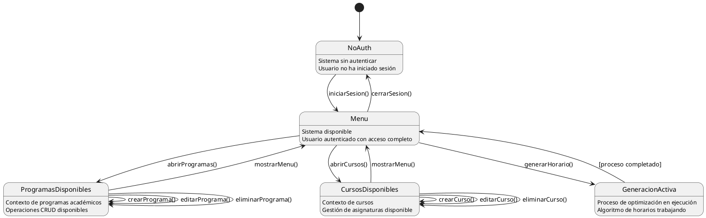
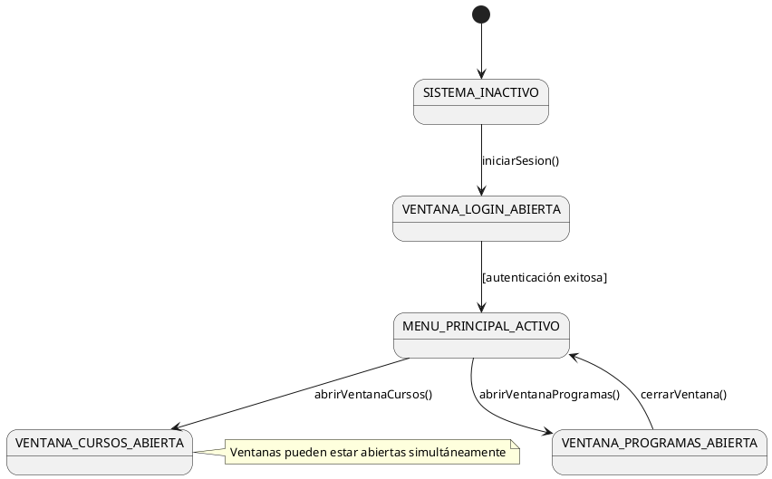
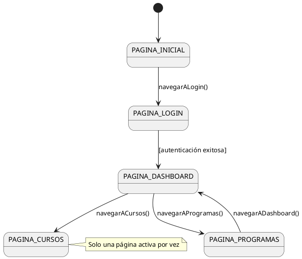
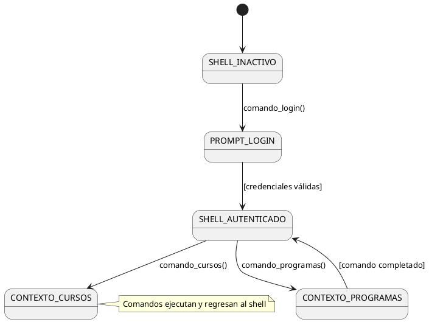
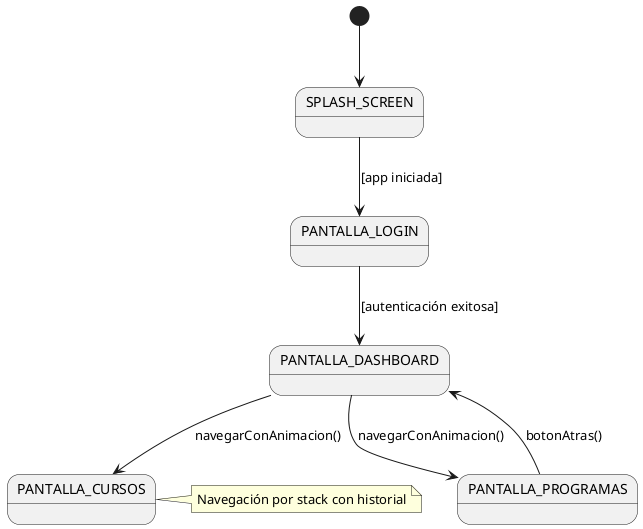

# Diagramas de contexto múltiples por tecnología: pureza metodológica vs implementación práctica

## Resumen ejecutivo

Este artículo propone una arquitectura de diagramas de contexto que reconcilia la tensión entre la pureza metodológica de RUP (análisis independiente de tecnología) y las necesidades prácticas de implementación en múltiples plataformas tecnológicas (GUI, Web, CLI, Móvil).

## Problema identificado

### La tensión metodológica

En el desarrollo del proyecto pySigHor-RUP surgió una tensión fundamental entre dos enfoques válidos:

#### Posición 1: Pureza metodológica

- El análisis RUP debe ser completamente independiente de tecnología
- Los diagramas de contexto no deben condicionar hacia paradigmas específicos de interfaz
- Las clases de análisis deben derivar de conceptos puros de negocio

#### Posición 2: Trazabilidad tecnológica

- Los diagramas de contexto ayudan a entender el comportamiento del sistema legacy
- La implementación final requiere consideraciones tecnológicas específicas
- La abstracción pura puede alejarse demasiado de la realidad implementable

### Manifestación concreta del problema

#### Caso de Estudio: estados del sistema

Diagrama actual:
```
SISTEMA_DISPONIBLE → abrirProgramas() → PROGRAMAS_ABIERTO
PROGRAMAS_ABIERTO → mostrarMenu() → SISTEMA_DISPONIBLE
```

#### Análisis del sesgo tecnológico:
- `PROGRAMAS_ABIERTO` implica paradigma de "ventanas abiertas" (GUI-centric)
- Nomenclatura sugiere apertura persistente de interfaces
- Estados condicionados por tecnología específica de ventanas

#### Principio metodológico violado:
**Los casos de uso atómicos son correctos** (`abrirProgramas()`, `crearPrograma()`, `editarPrograma()`), pero **los estados reflejan sesgo tecnológico** hacia paradigmas GUI de ventanas.

#### Problemas de implementación multiplataforma:

| Tecnología | Problema con Estados Actuales |
|------------|-------------------------------|
| **GUI/Desktop** | ✅ Funciona bien (ventanas múltiples simultáneas) |
| **Web/SPA** | ❌ Solo una vista activa, "abierto" no tiene sentido |
| **CLI** | ❌ Sin persistencia de estado, comandos secuenciales |
| **Móvil** | ❌ Navegación por stack, no ventanas "abiertas" |

## Propuesta: arquitectura de diagramas múltiples

### Concepto central

#### Separación de Responsabilidades:
1. **Diagrama Conceptual Puro** → Casos de uso atómicos con estados agnósticos tecnológicamente
2. **Diagramas Tecnológicos Específicos** → Agrupamiento y estados específicos por paradigma de interfaz

### Arquitectura propuesta

```
┌─────────────────────────────────┐
│     Diagrama Conceptual Puro    │
│       (Análisis RUP Puro)       │
│                                 │
│ Estados: PROGRAMAS_DISPONIBLES  │
│         PROGRAMA_SIENDO_CREADO  │
│         GENERACION_ACTIVA       │
└─────────────┬───────────────────┘
              │ (refinamiento tecnológico)
              ▼
┌─────────────┬─────────────┬─────────────┬─────────────┐
│    GUI      │    Web      │    CLI      │   Móvil     │
│ (Desktop)   │   (SPA)     │ (Terminal)  │ (Touch)     │
│             │             │             │             │
│ PROGRAMAS_  │ VISTA_      │ MODO_       │ PANTALLA_   │
│ ABIERTO     │ PROGRAMAS   │ PROGRAMAS   │ PROGRAMAS   │
└─────────────┴─────────────┴─────────────┴─────────────┘
```

### Diagrama conceptual puro

#### Características:
- **Mantiene atomicidad** de casos de uso RUP (una conversación = un resultado)
- Estados expresan **capacidades de negocio**, no paradigmas de interfaz
- Transiciones representan **casos de uso atómicos** específicos
- Nombres **agnósticos tecnológicamente** pero **semánticamente precisos**

#### Ejemplo de estados conceptuales:


### Diagramas tecnológicos específicos

#### 1. GUI/Desktop


#### 2. Web/SPA


#### 3. CLI


#### 4. Móvil


## Metodología de aplicación

### Fase 1: Análisis puro
1. **Crear diagrama conceptual puro** manteniendo atomicidad de casos de uso RUP
2. **Usar estados agnósticos** de paradigmas de interfaz específicos
3. **Derivar clases de análisis** del diagrama conceptual únicamente
4. **Especificar casos de uso** atómicos usando vocabulario de negocio

### Fase 2: Diseño tecnológico
1. **Seleccionar tecnología objetivo** (GUI, Web, CLI, Móvil)
2. **Crear diagrama tecnológico específico** agrupando casos de uso atómicos según paradigma
3. **Adaptar estados** a capacidades y limitaciones tecnológicas específicas
4. **Mantener trazabilidad** uno-a-uno con casos de uso del diagrama conceptual

### Fase 3: Validación cruzada
1. **Verificar cobertura completa** entre diagrama conceptual y tecnológicos
2. **Asegurar trazabilidad** de cada estado conceptual a implementaciones
3. **Validar consistencia** de casos de uso entre tecnologías

## Beneficios de la propuesta

### 1. Pureza metodológica preservada
- **Análisis RUP independiente** de consideraciones tecnológicas
- **Clases conceptuales** no contaminadas por paradigmas de implementación
- **Casos de uso puros** expresados en lenguaje de negocio

### 2. Implementación práctica facilitada
- **Guías específicas** para cada tecnología objetivo
- **Consideraciones realistas** de limitaciones y capacidades por plataforma
- **Trazabilidad clara** desde concepto hasta implementación

### 3. Escalabilidad y mantenimiento
- **Nuevas tecnologías** se agregan sin modificar el análisis puro
- **Cambios conceptuales** se propagan a todas las implementaciones
- **Validación arquitectónica** asegura consistencia multiplataforma

### 4. Comunicación mejorada
- **Stakeholders de negocio** trabajan con diagramas conceptuales
- **Equipos técnicos** trabajan con diagramas tecnológicos específicos
- **Arquitectos** mantienen coherencia entre niveles

## Casos de aplicación

### Proyecto pySigHor-RUP

#### Situación actual:
- Diagrama de contexto con sesgo GUI (estados "ABIERTO")
- Casos de uso acoplados tecnológicamente ("mostrarMenu")
- Análisis condicionado por paradigmas de interfaz

#### Aplicación de la propuesta:
1. **Mantener atomicidad** en diagrama conceptual (`abrirProgramas()`, `crearPrograma()`, `editarPrograma()`)
2. **Renombrar estados** tecnológicamente neutrales (`PROGRAMAS_DISPONIBLES` en lugar de `PROGRAMAS_ABIERTO`)
3. **Crear diagramas tecnológicos** que agrupen casos de uso atómicos según paradigma de interfaz
4. **Preservar trazabilidad** desde casos de uso atómicos hasta implementaciones específicas

### Otros Proyectos

Esta metodología es aplicable a cualquier proyecto que:
- **Requiera múltiples tecnologías** de interfaz
- **Use metodología RUP** con énfasis en pureza de análisis
- **Necesite trazabilidad** entre concepto e implementación
- **Busque escalabilidad** arquitectónica multiplataforma

## Implementación práctica

### Herramientas recomendadas
- **PlantUML** para todos los diagramas (versionable, textual)
- **Directorio por tecnología** en estructura de proyecto
- **Nomenclatura consistente** entre diagramas conceptual y tecnológicos

### Estructura de archivos propuesta
```
RUP/
├── 00-contexto-conceptual/
│   ├── diagrama-conceptual-puro.puml
│   └── estados-capacidades-negocio.md
├── 01-contextos-tecnologicos/
│   ├── GUI/
│   │   └── diagrama-contexto-gui.puml
│   ├── Web/
│   │   └── diagrama-contexto-web.puml
│   ├── CLI/
│   │   └── diagrama-contexto-cli.puml
│   └── Movil/
│       └── diagrama-contexto-movil.puml
└── 02-casos-uso/
    └── [derivados del contexto conceptual]
```

### Proceso de desarrollo
1. **Análisis**: Trabajar únicamente con diagrama conceptual
2. **Diseño**: Seleccionar tecnología y usar diagrama específico
3. **Implementación**: Seguir patrones del diagrama tecnológico
4. **Validación**: Verificar cobertura del diagrama conceptual

## Conclusiones

La propuesta de **diagramas de contexto múltiples por tecnología** resuelve efectivamente la tensión entre pureza metodológica y practicidad implementativa en proyectos RUP.

#### Principios clave:
- **Atomicidad de casos de uso preservada** en todos los niveles de diagrama
- **Separación de responsabilidades** entre análisis puro e implementación específica
- **Trazabilidad mantenida** desde casos de uso atómicos hasta código
- **Escalabilidad arquitectónica** para múltiples tecnologías
- **Preservación de la integridad** metodológica de RUP

Esta aproximación permite que los proyectos **mantengan rigor metodológico** sin sacrificar **viabilidad práctica** de implementación, creando un puente efectivo entre el mundo conceptual del análisis y las realidades tecnológicas del desarrollo moderno.

<div align=center>

||||
|-|-|-|
|||

</div>

## Referencias

- [Rational Unified Process - Guidelines for State Machine Diagrams](https://www.interface.ru/rational/rup51/process/modguide/md_stadm.htm)
- ["Object-Oriented Analysis and Design with Applications" - Grady Booch](https://www.pearson.com/en-us/subject-catalog/p/object-oriented-analysis-and-design-with-applications/P200000003391)
- ["UML 2.0 in a Nutshell" - Dan Pilone, Neil Pitman](https://www.oreilly.com/library/view/uml-20-in/0596007957/)
- [Conversation Log - pySigHor-RUP](../../../conversation-log.md) - conversaciones sobre pureza metodológica
- [Contexto del artículo](contexto.md) - origen y antecedentes de la reflexión
- [Evidencia de la propuesta](evidencia.md) - demostración práctica y validación